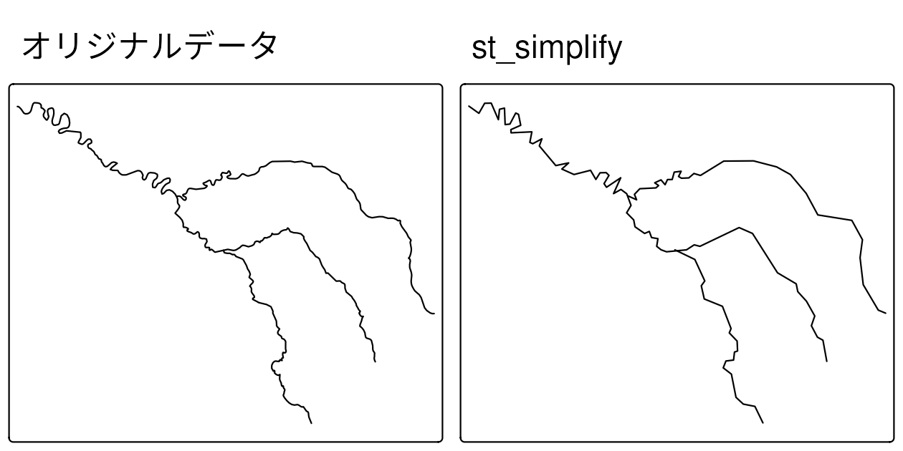
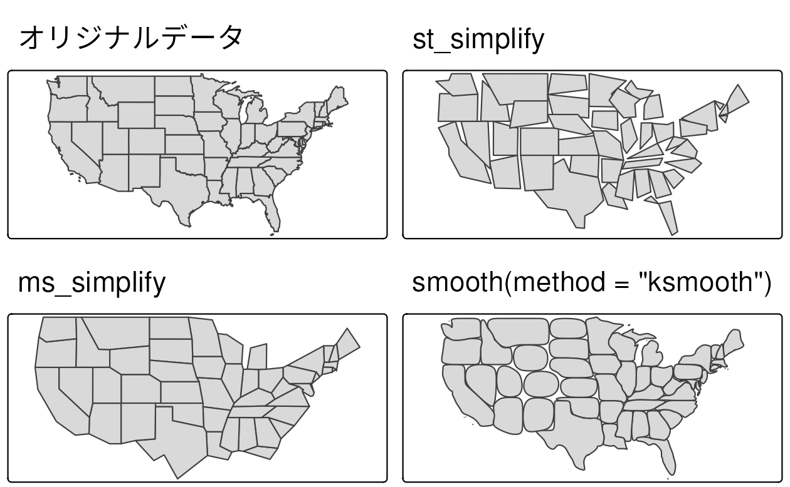
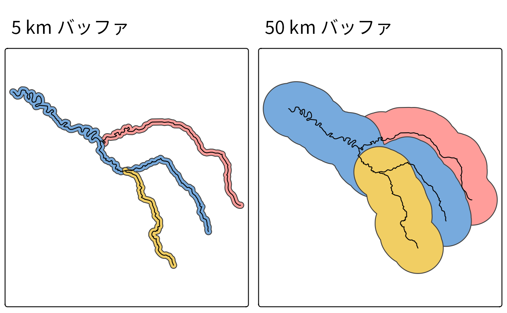
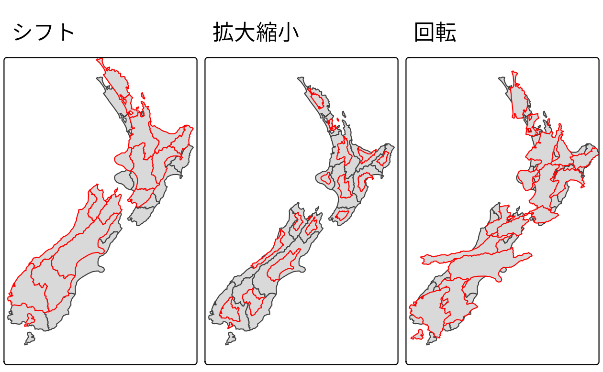
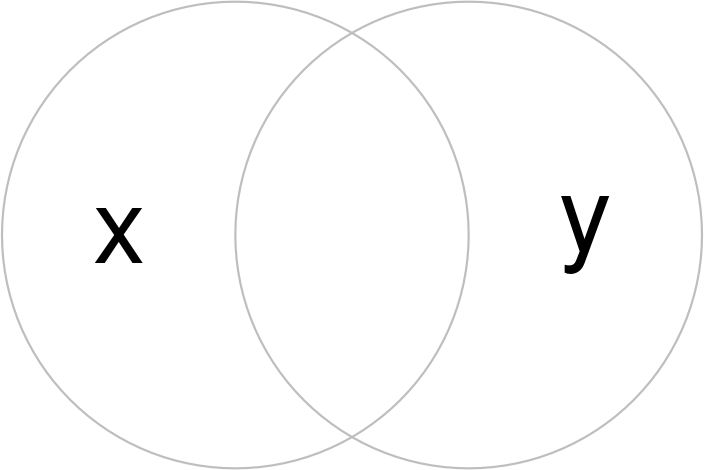
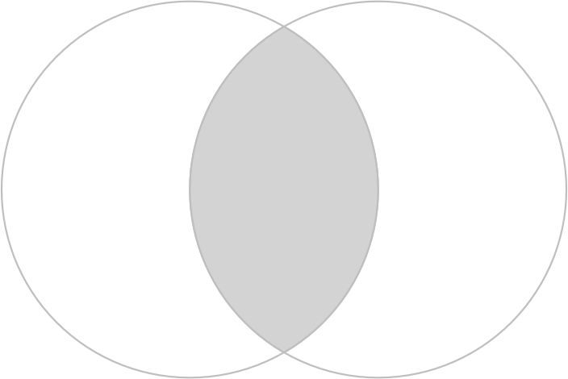
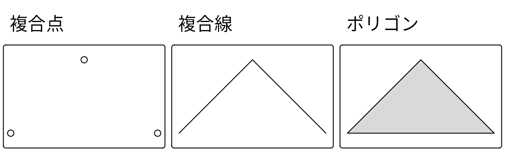
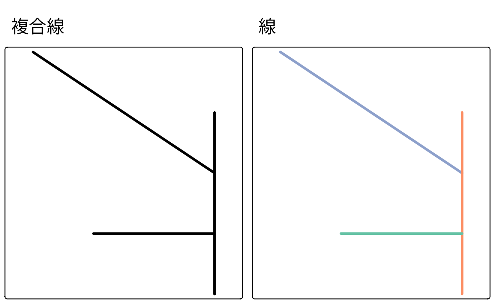
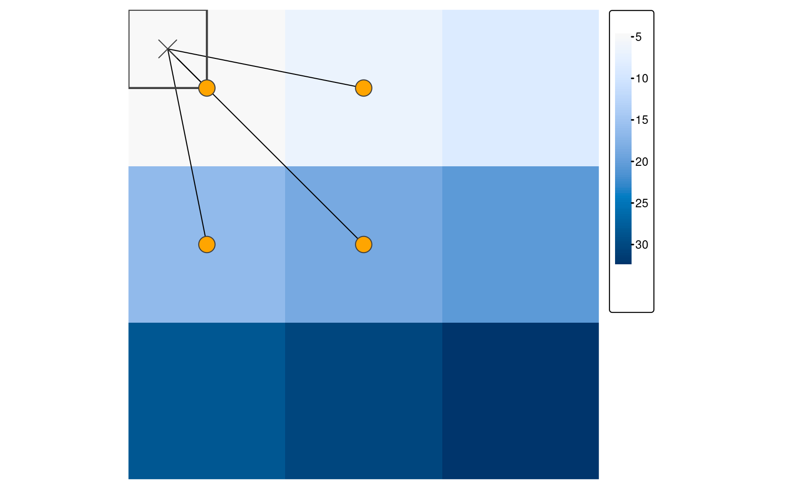

# ジオメトリ演算  {#geometry-operations}


## 必須パッケージ  {- #prerequisites-05}

- この章では、Chapter \@ref(spatial-operations) と同じパッケージを使用するが、Chapter \@ref(spatial-class) でインストールされた **spDataLarge** を追加している。


``` r
library(sf)
library(terra)
library(dplyr)
library(spData)
library(spDataLarge)
```

## イントロダクション  {#introduction-05}

これまで本書では、地理データセットの構造 (Chapter \@ref(spatial-class))、地理以外の属性 (Chapter \@ref(attr)) と空間関係 (Chapter \@ref(spatial-operations)) に基づく操作方法について説明してきた。
この章では、バッファ作成、ベクタの簡略化と変換、ラスタデータの集計や最サンプルなど、空間オブジェクトの地理的要素の操作に重点を置いている。
この本を読めば (そして最後にある演習を試した後)、`sf` オブジェクトのジオメトリ列と、他の地理的オブジェクトとの関係でラスタに表されたピクセルの範囲と地理的位置を理解し、コントロールできるようになるはずである。

Section \@ref(geo-vec) は、「単項」と「二項」演算によるベクタジオメトリの変換を扱う。
単項演算 (unary operation) とは、単体のジオメトリに対して、線分やポリゴンの単純化、バッファや中心点の作成、「アフィン変換」による単体のジオメトリの移動・拡大・縮小・回転などを行う (Section \@ref(simplification) ～ Section \@ref(affine-transformations) を参照)。
一方、二項変換 (binary transformations) とは、あるジオメトリを別のジオメトリの形状に基づいて変更するもので、Section \@ref(clipping) で切り取り (clip) を、Section \@ref(geometry-unions) で結合\index{べくた@ベクタ!けつごう@結合} (union) を説明する。
ジオメトリ型の変換 (例えば、ポリゴンからラインへの変換) は、Section \@ref(type-trans) で実際に行う。

Section \@ref(geo-ras) は、ラスタオブジェクトの幾何学変換を扱っている。
これは、基本となる画素のサイズと数を変更し、新しい値を割り当てるというものである。
ラスタの解像度 (ラスタ集計・分解ともいう)、範囲、原点を変更する方法を教える。
これらの操作は、異なるソースのラスタデータセットの位置合わせを行う場合に特に有効である。
整列されたラスタオブジェクトは、ピクセル間の一対一の対応を共有し、Section \@ref(map-algebra) で説明されているマップ代数演算を使用して処理することができる。

Section \@ref(raster-vector) では、ベクタオブジェクトとラスタオブジェクトの間の操作をカバーする。 
ラスタ値をベクタジオメトリで「マスク」し、「抽出」する方法を紹介する。
重要なのは、ラスタデータを「ポリゴン化」し、ベクタデータを「ラスタ化」する方法を示し、この2つのデータモデルをより互換性のあるものにすることである。

## ベクタデータに対するジオメトリ操作  {#geo-vec}

ここでは、ベクタ (`sf`) オブジェクトのジオメトリを何らかの方法で変更する操作について説明する。
前の章 (Section \@ref(spatial-vec)) で紹介した空間データ操作よりも高度なもので、ここではジオメトリを掘り下げていくことがある。
このセクションで説明する関数は、クラス `sf` のオブジェクトに加えて、クラス `sfc` のオブジェクトにも作用する。

### 簡略化  {#simplification}

\index{べくた@ベクタ!かんりゃくか@簡略化} 
簡略化とは、通常、縮尺の小さい地図で使用するために、ベクタオブジェクト (線やポリゴン) を一般化する処理のことである。
オブジェクトを単純化するもう一つの理由は、それらが消費するメモリ、ハードディスク容量、ネットワーク帯域幅の量を減らすためである。
インタラクティブ地図として公開する前に、複雑な形状を簡略化することが賢明だろう。 
**sf** パッケージは `st_simplify()` を提供する。これは Douglas-Peucker アルゴリズムの実装を使用して、頂点数を削減するものである。
`st_simplify()` は、`dTolerance` を使用することで、一般化のレベルを地図で使われている単位で制御することができる  [詳細は @douglas_algorithms_1973]。
Figure \@ref(fig:seine-simp) は、セーヌ川とその支流を表すジオメトリ `LINESTRING` を簡略化したものである。
以下のコマンドで簡略化したジオメトリを作成してみよう。


``` r
seine_simp = st_simplify(seine, dTolerance = 2000) # 2000 m
```

<div class="figure" style="text-align: center">

<p class="caption">(\#fig:seine-simp)seine のオリジナルと簡略化した形状の比較。</p>
</div>

ここでできた `seine_simp` オブジェクトは、元の `seine` のコピーであるが、頂点の数は少なくなっている。
これは明らかで、以下の検証のように、結果は視覚的にシンプルになり (Figure \@ref(fig:seine-simp)、右)、元のオブジェクトよりもメモリ消費が少ない。


``` r
object.size(seine)
#> 18096 bytes
object.size(seine_simp)
#> 9112 bytes
```

\index{べくた@ベクタ!かんりゃくか@簡略化} 
簡略化はポリゴンにも適用できる。
下の例は、米国本土 `us_states` を表している。


``` r
us_states_simp1 = st_simplify(us_states, dTolerance = 100000) # 100 km
```

`st_simplify()` の制限として、ジオメトリ単位でオブジェクトを簡略化することが挙げられる。
このため、「トポロジー」が失われ、Figure \@ref(fig:us-simp) (パネル右上) に示すような、重なり合った「穴のあいた」面単位になってしまうのである。
**rmapshaper** の `ms_simplify()` が代替となる。
デフォルトでは、Douglas-Peucker アルゴリズムのいくつかの制限を克服した Visvalingam アルゴリズムが使用される [@visvalingam_line_1993]。
<!-- https://bost.ocks.org/mike/simplify/ -->
次のコードチャンクは、この関数を使用して、`us_states` を簡略化している。
結果は入力 (引数 `keep` で設定) の 1% の頂点しか持たないが、`keep_shapes = TRUE` を設定したため、オブジェクトの数はそのままである。^[
マルチポリゴンオブジェクトの簡略化では、`keep_shapes` 引数が TRUE に設定されていても、内部の小さなポリゴンが削除されることがある。これを防ぐには、`explode = TRUE` を設定する必要がある。このオプションは、単純化する前に、すべてのマルチポリゴンを個別のポリゴンに変換する。
]


``` r
# 保持するポイントの割合 (0～1、デフォルト 0.05)
us_states_simp2 = rmapshaper::ms_simplify(us_states, keep = 0.01,
                                          keep_shapes = TRUE)
```

\index{べくた@ベクタ!かんりゃくか@簡略化}
簡略化の代わりに、ポリゴンや線のジオメトリの境界を平滑化するという方法もあり、**smoothr** パッケージ\index{smoothr (package)}で実装されている。
平滑化はジオメトリのエッジを補間するため、必ずしも頂点の数が少なくなるわけではないが、ラスタを空間的にベクトル化したジオメトリを扱うときに特に有用である (このトピックは Chapter \@ref(raster-vector) で説明する)。
**Smoothr** は、Gaussian kernel 回帰、Chaikin's corner cutting アルゴリズム、スプライン補間の 3 つの平滑化手法を実装しており、パッケージ vignette と[web](https://strimas.com/smoothr/)で説明されている。
`st_simplify()` と同様に、平滑化アルゴリズムは「トポロジー」を保存しないことに注意。
**smoothr** の主要関数は `smooth()` であり、 `method` 引数は使用する平滑化手法を指定する。
以下は、Gaussian kernel 回帰を使用して、`method=ksmooth` を使用して米国の州の境界線を滑らかにする。
引数 `smoothness` は、形状を滑らかにするために使用するガウスの帯域幅を制御する。デフォルト値は 1。


``` r
us_states_simp3 = smoothr::smooth(us_states, method = "ksmooth", smoothness = 6)
```

最後に、元のデータセットと 2 つの簡易版を視覚的に比較してみよう。
Figure \@ref(fig:us-simp) で、Douglas-Peucker (`st_simplify`)、Visvalingam (`ms_simplify`)、Gaussian kernel 回帰 (`smooth(method=ksmooth`) アルゴリズムの出力に違いがあることがわかる。

<div class="figure" style="text-align: center">

<p class="caption">(\#fig:us-simp)ポリゴンの簡略化。sf (右上)、rmapshaper (左下)、smoothr (右下) の各パッケージの関数で生成された簡略版と元のアメリカ合衆国のジオメトリ形状を比較。</p>
</div>

### 重心  {#centroids}

\index{べくた@ベクタ!じゅうしん@重心} 
重心 (centroid) 演算は、地理的な物体の中心を特定するものである。
統計的な中心傾向の測定 (「平均」の平均値や中央値の定義を含む) と同様に、物体の地理的な中心を定義する方法はたくさんある。
いずれも、より複雑なベクタオブジェクトの一点表現を作成する。

重心の操作で最もよく使われるのは、<u>地理的重心</u>である。
このタイプの重心操作 (「セントロイド」とも呼ばれる) は、空間オブジェクトにおける質量の中心を表す (指の上で皿のバランスをとることを想像してほしい)。
地理的重心は、複雑な形状をシンプルな点で表現したり、ポリゴン間の距離を推定したりと、さまざまな用途に利用されている。
これらは、以下のコードで示すように、**sf** 関数 (`st_centroid()`) で計算することができる。では、New Zealand の地域とセーヌ川の支流の地理的重心 (Figure \@ref(fig:centr) の黒い点で示される) を生成してみよう。


``` r
nz_centroid = st_centroid(nz)
seine_centroid = st_centroid(seine)
```

地理的重心は、親オブジェクトの境界の外にあることもある (ドーナツを想像すればよい)。
このような場合、親オブジェクトに点があることを保証するために、*point on surface* オペレーションを使用することができ (例: 島国のような不規則なマルチポリゴンオブジェクトのラベル付け)、Figure \@ref(fig:centr) の赤い点に示されている。
これらの赤い点は、常に親オブジェクトの上にあることに確認しておこう。
`st_point_on_surface()` を使い、以下のように作成する。^[
`st_point_on_surface()` の動作の説明は、https://gis.stackexchange.com/a/76563/20955 に記載されている。
]


``` r
nz_pos = st_point_on_surface(nz)
seine_pos = st_point_on_surface(seine)
```

<div class="figure" style="text-align: center">

<p class="caption">(\#fig:centr)New Zealand の地域 (左) とセーヌ川 (右) のデータセットの重心 (黒い点) と「サーフェス上の点」(赤い点)。</p>
</div>

重心には、他にも<u>チェビシェフ中心</u>や<u>ビジュアル中心</u>などが存在する。
ここでは深入りしないが、Chapter \@ref(algorithms) で見るように、R を使って計算することが可能である。

### バッファ  {#buffers}

\index{べくた@ベクタ!ばっふぁ@バッファ} 
バッファとは、フィーチャから一定距離内の領域を表すポリゴンのことである。
入力が点、線、ポリゴンのいずれであっても、出力はバッファとなる。
簡略化 (可視化やファイルサイズの縮小によく使われる) とは異なり、バッファ作成は地理的なデータ解析に使われる傾向がある。
この線から所定の距離内にある点はいくつあるか?
この新店舗から移動可能な距離にあるのは、どのような層なのだろうか?
このような疑問には、関心のある地理的要素の周囲にバッファを作成することで回答し、可視化することができる。

Figure \@ref(fig:buffs) は、セーヌ川と支流を囲む様々な大きさの緩衝地帯 (5 km と 50 km)を示している。
これらのバッファは以下のコマンドで作成できる。コマンド `st_buffer()` は少なくとも 2 つの引数を必要とする。入力ジオメトリと、CRS の単位 (この場合はメートル) で指定された距離である。


``` r
seine_buff_5km = st_buffer(seine, dist = 5000)
seine_buff_50km = st_buffer(seine, dist = 50000)
```

<div class="figure" style="text-align: center">

<p class="caption">(\#fig:buffs)Seine データセット周辺の 5 km (左) と 50 km (右) のバッファ。ジオメトリフィーチャごとに 1 つのバッファが作成されることを反映した色に注目。</p>
</div>

\BeginKnitrBlock{rmdnote}<div class="rmdnote">`st_buffer()` には、追加の引数がある。
最も重要な引数は、以下の通り。

- `nQuadSegs` (GEOS\index{GEOS} エンジン使用時): これは「1 象限あたりの分割数」を意味し、デフォルトでは 30 に設定されている (バッファで作られる円は $4 \times 30 = 120$ ラインで構成されることを意味する)。
この引数が有用な例外的なケースとしては、バッファ操作の出力によって消費されるメモリが大きな懸念材料である場合 (この場合は減らす)、または非常に高い精度が必要な場合 (この場合は増やす)。
- `max_cells` (S2\index{S2} エンジン使用時): 値が大きいほどバッファが滑らかになるが、時間がかかる
- `endCapStyle` と `joinStyle` (GEOS エンジン使用時): バッファの縁の見た目を制御する
- `singleSide` (GEOS エンジン使用時): バッファを入力ジオメトリの片側につくるか両側につくるかを制御する
</div>\EndKnitrBlock{rmdnote}


### アフィン変換  {#affine-transformations}

\index{べくた@ベクタ!あふぃんへんかん@アフィン変換} 
アフィン変換とは、直線と平行を保存する変換のことである。
ただし、角度や長さは必ずしも保存されるとは限らない。
アフィン変換には、特に、平行移動、拡大縮小、回転が含まれる。
さらに、これらを任意に組み合わせて使用することも可能である。
アフィン変換はジオコンピュテーションに不可欠な要素である。
例えば、ラベルの配置には平行移動が必要であり、非連続領域のカルトグラムでは拡大縮小が使用され (Section \@ref(other-mapping-packages) 参照)、歪んだ地図や間違った投影に基づいて作成されたジオメトリを再投影または改善する際には多くのアフィン変換が適用される。
**sf** パッケージは `sfg` と `sfc` のクラスのオブジェクトに対してアフィン変換を実装している。


``` r
nz_sfc = st_geometry(nz)
```

平行移動は、すべての点を地図単位で同じ距離だけ移動させる。
ベクタオブジェクトに数値ベクタを追加することで、実現できるだろう。
例えば、以下のコードでは、すべての y 座標を北に 10 万メートル移動させ、x 座標はそのままにしている (Figure \@ref(fig:affine-trans) 左図)。


``` r
nz_shift = nz_sfc + c(0, 100000)
```

拡大縮小は、オブジェクトを係数倍ずつ拡大または縮小する機能である。
グローバルにもローカルにも適用可能である。
グローバル拡大縮小は、すべてのジオメトリの位相関係を維持したまま、原点座標を基準としてすべての座標値を増減させる。
`sfg`、`sfc` オブジェクトの減算または乗算によって行うことができる。


ローカル拡大縮小はジオメトリを独立して扱い、ジオメトリが拡大縮小されるポイント (重心など) を必要とする。
以下の例では、各ジオメトリは重心を中心に2倍に縮小されている (Figure \@ref(fig:affine-trans) 中央)。
そのために、まず各オブジェクトは、その中心が `0, 0` (`(nz_sfc - nz_centroid_sfc)`) の座標となるように移動される。 
次に、ジオメトリのサイズを半分に縮小する (`* 0.5`)。
最後に、各オブジェクトの重心を入力データの座標に戻す (`+ nz_centroid_sfc`)。


``` r
nz_centroid_sfc = st_centroid(nz_sfc)
nz_scale = (nz_sfc - nz_centroid_sfc) * 0.5 + nz_centroid_sfc
```

2 次元座標の回転には、回転行列が必要である。

$$
R =
\begin{bmatrix}
\cos \theta & -\sin \theta \\  
\sin \theta & \cos \theta \\
\end{bmatrix}
$$

時計回りにポイントを回転させる。
回転行列は R で次のように実装することができる。


``` r
rotation = function(a){
  r = a * pi / 180 # 度をラジアンに変換
  matrix(c(cos(r), sin(r), -sin(r), cos(r)), nrow = 2, ncol = 2)
} 
```

`rotation` 関数は、1 つの引数 `a` (回転角度, angle) を度単位で受け取る。
重心のような選択された点を中心に回転させることができる (Figure \@ref(fig:affine-trans) 右図)。
その他の例については、`vignette("sf3")` を参照 (訳注: [日本語版](https://www.uclmail.net/users/babayoshihiko/R/index.html))。


``` r
nz_rotate = (nz_sfc - nz_centroid_sfc) * rotation(30) + nz_centroid_sfc
```

<div class="figure" style="text-align: center">

<p class="caption">(\#fig:affine-trans)アフィン変換 (平行移動、拡大縮小、回転)。</p>
</div>


最後に、新しく作成されたジオメトリは、`st_set_geometry()` 関数を使用して古いジオメトリを置き換えることができる。 


``` r
nz_scale_sf = st_set_geometry(nz, nz_scale)
```

### 切り取り (clip)  {#clipping}

\index{べくた@ベクタ!きりとり@切り取り} 
\index{くうかん@空間!ぶぶんしゅうごう@部分集合} 
空間切り取り (clip) は、空間部分集合の作成の一種で、影響を受けるフィーチャの少なくとも一部の `geometry` 列を変更するものである。

切り取りは、
点よりも複雑なフィーチャである線、ポリゴン、およびそれらの複合にしか適用できない。 
コンセプトを説明するために、まずは簡単な例で説明する。
中心点が互いに 1 単位離れていて、半径が 1 である 2 つの重なり合った円を用意しよう (Figure \@ref(fig:points))。


``` r
op = par(mar = rep(0, 4))
b = st_sfc(st_point(c(0, 1)), st_point(c(1, 1))) # 点を二つ作成
b = st_buffer(b, dist = 1) # 点を円に変換
plot(b, border = "gray")
text(x = c(-0.5, 1.5), y = 1, labels = c("x", "y"), cex = 3) # テキストを追加
```

<div class="figure" style="text-align: center">

<p class="caption">(\#fig:points)重なり合った円。</p>
</div>


どちらかの円を選択するのではなく、`x` <u>と</u> `y` の両方で覆われた空間を選択したい。
これは、関数 `st_intersection()`\index{べくた@ベクタ!こうさ@交差}、左手と右手の円を表す `x` と `y` というオブジェクトを使って説明することができる (Figure \@ref(fig:circle-intersection))。


``` r
op = par(mar = rep(0, 4))
x = b[1]
y = b[2]
x_and_y = st_intersection(x, y)
plot(b, border = "gray")
plot(x_and_y, col = "lightgray", border = "gray", add = TRUE) # 範囲を intersect
```

<div class="figure" style="text-align: center">

<p class="caption">(\#fig:circle-intersection)重なり合った円はグレーで表示され、円同士が交差していることを示す。</p>
</div>


次のコードチャンクは、`x` と `y` を表すベン図のすべての組み合わせに対して、これがどのように機能するかを示している。これは、書籍 *R for Data Science* の [Figure 5.1](https://r4ds.had.co.nz/transform.html#logical-operators) から着想を得ている [@grolemund_r_2016]。

<div class="figure" style="text-align: center">

<p class="caption">(\#fig:venn-clip)論理演算子の空間的等価性。</p>
</div>

### 部分集合と切り取り (clip)

\index{べくた@ベクタ!きりとり@切り取り} 
\index{くうかん@空間!ぶぶんしゅうごう@部分集合} 
オブジェクトの切り取りは、その形状を変更することができるが、オブジェクトを部分集合を作成することもでき、切り取り/部分集合オブジェクトと交差する (または部分的に交差する) フィーチャのみを返す。
この点を説明するために、を Figure \@ref(fig:venn-clip) の円 `x` と `y` の境界ボックスをカバーする点の部分集合を作成しよう。
ある点は1つの円の中に入り、ある点は両方の円の中に入り、ある点はどちらの円の中にも入らない。
`st_sample()` は、円 `x` と `y` の範囲内にある点を <u>単純なランダム化</u>をして生成し、Figure \@ref(fig:venn-subset)  に示すような出力を得るために、以下のように使用する。ここで一つ問題がある。円 `x` と `y` 両方と交差する点の部分集合はどのように得られるだろうか？

<div class="figure" style="text-align: center">

<p class="caption">(\#fig:venn-subset)円x、yを囲むバウンディングボックス内にランダムに分布する点。オブジェクトx、yの両方と交差する点がハイライトされる。</p>
</div>


``` r
bb = st_bbox(st_union(x, y))
box = st_as_sfc(bb)
set.seed(2024)
p = st_sample(x = box, size = 10)
x_and_y = st_intersection(x, y)
```

以下のコードは、同じ結果を得るための3つの方法を示している。
以下のコードチャンクの最初の行に示すように、`x` と `y` の交差\index{べくた@ベクタ!こうさ@交差} (前のコードチャンクでは `x_and_y` で表される) を直接部分集合オブジェクトとして使用することができる。
また、以下のコードチャンクの 2 行目で示すように、`p` で表される入力点と部分集合/クリッピングオブジェクト `x_and_y` との<u>交点</u>を求めることもできる。
この第二のアプローチは、`x_and_y` と部分的に交差するフィーチャを返すが、部分集合・オブジェクトの境界を越える空間的に広範囲なフィーチャについては、形状を修正したものを返すことになる。
3 つ目のアプローチは、前の章で紹介した二項の空間述語 `st_intersects()` を使って部分集合オブジェクトを作成することである。
結果は (属性名の表面的な違いを除いて) 同じだが、実装は大きく異なる。


``` r
# way #1
p_xy1 = p[x_and_y]
# way #2
p_xy2 = st_intersection(p, x_and_y)
# way #3
sel_p_xy = st_intersects(p, x, sparse = FALSE)[, 1] & 
  st_intersects(p, y, sparse = FALSE)[, 1]
p_xy3 = p[sel_p_xy]
```


上記の例は、応用というより教育的な目的で作成されたものであり、R で地理的ベクタオブジェクトを扱うための理解を深めるために結果を再現することを勧める。しかし、これは、どの実装を使うべきかという重要な問題を提起している。
一般に、上記の最初のアプローチのような簡潔な実装が好まれる。
Chapter \@ref(algorithms) では、同じ技術やアルゴリズムの異なる実装を選択する問題に戻る。

### ジオメトリ結合  {#geometry-unions}

\index{べくた@ベクタ!けつごう@結合} 
\index{しゅうやく@集約!くうかん@空間} 
Section \@ref(vector-attribute-aggregation) で見たように、空間的な集約は、同グループの接しているポリゴンのジオメトリを静かにディゾルブ (dissolve) させることができる。
以下のコードでは、Base と **dplyr**\index{dplyr (package)} 関数を使って 48 の米国の州と District of Columbia  (`us_states`) を 4 つの地域に集約している (結果は Figure \@ref(fig:us-regions) を参照)。


``` r
regions = aggregate(x = us_states[, "total_pop_15"], by = list(us_states$REGION),
                    FUN = sum, na.rm = TRUE)
regions2 = us_states |> 
  group_by(REGION) |>
  summarize(pop = sum(total_pop_15, na.rm = TRUE))
```


<div class="figure" style="text-align: center">

<p class="caption">(\#fig:us-regions)連続したポリゴンに対する空間的な集計。アメリカの州の人口を地域に集計し、人口を色で表した。この操作により、州間の境界が自動的に解消されることに注意。</p>
</div>

ジオメトリ的にはどうなっているのだろうか？
裏側では、`aggregate()` と `summarize()` の両方がジオメトリを結合し、`st_union()` を使ってジオメトリ間の境界を解消している。
これは、アメリカ西部の連合体を作成する以下のコードチャンクで実証されている。 


``` r
us_west = us_states[us_states$REGION == "West", ]
us_west_union = st_union(us_west)
```

この関数は 2 つの形状を受け取り、結合することができる。以下のコードでは、Texas を組み込んだ西側のブロックを結合している (課題: 結果を再現してプロットしなさい)。


``` r
texas = us_states[us_states$NAME == "Texas", ]
texas_union = st_union(us_west_union, texas)
```


### ジオメトリ型の変換  {#type-trans}

\index{べくた@ベクタ!じおめとりがたきゃすと@ジオメトリ型キャスト} 
ジオメトリキャストは、ジオメトリ型の変換を可能にする強力な操作である。
これは、**sf** パッケージの `st_cast()` 関数で実装されている。
重要なことは、`st_cast()` は、単一のシンプルフィーチャ (`sfg`) オブジェクト、シンプルフィーチャ列 (`sfc`)、およびシンプルフィーチャオブジェクトで異なる動作をすることである。

ここでは、複合点を作成して、シンプルフィーチャ (`sfg`) オブジェクトに対するジオメトリ型のキャストの動作を説明する。


``` r
multipoint = st_multipoint(matrix(c(1, 3, 5, 1, 3, 1), ncol = 2))
```

この場合、`st_cast()` は新しいオブジェクトを線やポリゴン (Figure \@ref(fig:single-cast)) に変換するのに便利である。


``` r
linestring = st_cast(multipoint, "LINESTRING")
polyg = st_cast(multipoint, "POLYGON")
```

<div class="figure" style="text-align: center">

<p class="caption">(\#fig:single-cast)多点ジオメトリからキャストされた線とポリゴンの例。</p>
</div>

複合点から線への変換は、GPS 測定やジオタグ付きメディアなど、順序付けられたポイント観測から線オブジェクトを作成する一般的な操作である。
これにより、移動した経路の長さを計算するなどの空間演算を行うことができる。
複合点や線からポリゴンへの変換は、例えば、湖の周囲で取得した GPS 測定値のセットや建物の敷地の角から面積を計算するためによく使われる。

また、`st_cast()` では、逆の変換をすることも可能である。


``` r
multipoint_2 = st_cast(linestring, "MULTIPOINT")
multipoint_3 = st_cast(polyg, "MULTIPOINT")
all.equal(multipoint, multipoint_2)
#> [1] TRUE
all.equal(multipoint, multipoint_3)
#> [1] TRUE
```

\BeginKnitrBlock{rmdnote}<div class="rmdnote">単純なジオメトリ (`sfg`) に対して、`st_cast()` は、非複合タイプから複合タイプ (例えば、`POINT` から `MULTIPOINT`) や複合タイプから非複合タイプへのジオメトリキャストも提供する。
しかし、複合タイプから非複合タイプにキャストする場合、古いオブジェクトの最初の要素だけが出力オブジェクトに残る。</div>\EndKnitrBlock{rmdnote}


シンプルフィーチャのジオメトリ列 (`sfc`) とシンプルフィーチャオブジェクトのジオメトリキャストは、ほとんどの場合、`sfg` の場合と同じように動作する。 
重要な違いの 1 つは、複合タイプから非複合タイプへの変換である。
この処理の結果、`sfc` または `sf` の複合オブジェクトは、多数の非複合オブジェクトに分割される。

以下のような `sf` オブジェクトを持っている。

- `POI` - 点 (定義上、一つの点)
- `MPOI` - 4 点からなる複合点
- `LIN` - 5 点からなる線
- `MLIN` - 二つの線の複合線 (5 つの点と 2 つの点)
- `POL` - ポリゴン (5 つの点)
- `MPOL` - 二つのポリゴンからなる複合ポリゴン (どちらも 5 つの点)
- `GC` - GEOMETRYCOLLECTION で複合点 (4 つの点) と線 (5 つの点)

Table \@ref(tab:sfs-st-cast) は、シンプルフィーチャに対して可能なジオメトリタイプの変換を示したものである。
単一のシンプルフィーチャ (表の最初の列で表される) は、Table \@ref(tab:sfs-st-cast) の列で表される複数のジオメトリタイプに変換することができる。
例えば、1 つの点から複数行の文字列やポリゴンに変換することはできない。`[1, 4:5]` のセルに NA が含まれている理由を説明する。
一部の変換では、単一のフィーチャ入力を複数のサブフィーチャに分割し、`sf` オブジェクトを「拡張」(重複する属性値を持つ新しい行を追加) している。
例えば、5 組の座標からなる多点ジオメトリを「POINT」ジオメトリに変換すると、出力には 5 つのフィーチャが含まれる。


Table: (\#tab:sfs-st-cast)シンプルフィーチャジオメトリ  (Section 2.1 参照) に対する 入力型は行、出力型は列で指定。

|        | POI| MPOI| LIN| MLIN| POL| MPOL| GC|
|:-------|---:|----:|---:|----:|---:|----:|--:|
|POI(1)  |   1|    1|   1|   NA|  NA|   NA| NA|
|MPOI(1) |   4|    1|   1|    1|   1|   NA| NA|
|LIN(1)  |   5|    1|   1|    1|   1|   NA| NA|
|MLIN(1) |   7|    2|   2|    1|  NA|   NA| NA|
|POL(1)  |   5|    1|   1|    1|   1|    1| NA|
|MPOL(1) |  10|    1|  NA|    1|   2|    1|  1|
|GC(1)   |   9|    1|  NA|   NA|  NA|   NA|  1|

__Note:__
注: 括弧内の値はフィーチャ数を表し、NA は操作が不可能なことを表す。


例として、新しいオブジェクトである `multilinestring_sf` にジオメトリタイプの変換を適用してみよう (Figure \@ref(fig:line-cast) の左側)。


``` r
multilinestring_list = list(matrix(c(1, 4, 5, 3), ncol = 2), 
                            matrix(c(4, 4, 4, 1), ncol = 2),
                            matrix(c(2, 4, 2, 2), ncol = 2))
multilinestring = st_multilinestring((multilinestring_list))
multilinestring_sf = st_sf(geom = st_sfc(multilinestring))
multilinestring_sf
#> Simple feature collection with 1 feature and 0 fields
#> Geometry type: MULTILINESTRING
#> Dimension:     XY
#> Bounding box:  xmin: 1 ymin: 1 xmax: 4 ymax: 5
#> CRS:           NA
#>                             geom
#> 1 MULTILINESTRING ((1 5, 4 3)...
```

道路や河川のネットワークをイメージしていただきたい。 
新しいオブジェクトは、すべての線を定義する 1 つの行だけを持っている。
このため、各線分に名前を付けたり、1 本の線の長さを計算したりすることができないなど、実行できる操作に制限がある。
このような場合、1 つの複合線を 3 つの線に分離する `st_cast()` 関数を使用することができる。


``` r
linestring_sf2 = st_cast(multilinestring_sf, "LINESTRING")
linestring_sf2
#> Simple feature collection with 3 features and 0 fields
#> Geometry type: LINESTRING
#> Dimension:     XY
#> Bounding box:  xmin: 1 ymin: 1 xmax: 4 ymax: 5
#> CRS:           NA
#>                    geom
#> 1 LINESTRING (1 5, 4 3)
#> 2 LINESTRING (4 4, 4 1)
#> 3 LINESTRING (2 2, 4 2)
```

<div class="figure" style="text-align: center">

<p class="caption">(\#fig:line-cast)複合線 (左) と線 (右) 間の型キャストの例。</p>
</div>

新しく作成されたオブジェクトでは、属性の作成 (詳しくは Section \@ref(vec-attr-creation) を参照) や長さの測定が可能である。


``` r
linestring_sf2$name = c("Riddle Rd", "Marshall Ave", "Foulke St")
linestring_sf2$length = st_length(linestring_sf2)
linestring_sf2
#> Simple feature collection with 3 features and 2 fields
#> Geometry type: LINESTRING
#> Dimension:     XY
#> Bounding box:  xmin: 1 ymin: 1 xmax: 4 ymax: 5
#> CRS:           NA
#>                    geom         name length
#> 1 LINESTRING (1 5, 4 3)    Riddle Rd   3.61
#> 2 LINESTRING (4 4, 4 1) Marshall Ave   3.00
#> 3 LINESTRING (2 2, 4 2)    Foulke St   2.00
```

## ラスタデータに対するジオメトリ操作  {#geo-ras}

\index{らすた@ラスタ!そうさ@操作} 
幾何学的なラスタ操作には、画像の平行移動 (shift)、反転 (flip)、ミラー (mirror)、拡大縮小 (scale)、回転 (rotate)、幾何補正 (warp) などがある。
これらの操作は、ジオリファレンスなど様々な用途で必要とされ、既知の CRS を持つ正確な地図に画像を重ね合わせるために使用される [@liu_essential_2009]。
ジオリファレンスには、さまざまな手法が存在する。

- 既知の[地上基準点](https://www.qgistutorials.com/en/docs/3/georeferencing_basics.html)に基づく地理補正 (georectification)
- 局所的な地形も考慮したオルソ補正 (orthorectification)
- 画像[位置合わせ](https://en.wikipedia.org/wiki/Image_registration) (image registration) は、異なるセンサーから撮影された同じものの画像を、ある画像と別の画像に (座標系や解像度の点で) 位置合わせして結合するために使用する。

最初の 2 つについては、手作業が必要になることが多いため、R はむしろ不向きで、通常は専用の GIS ソフトウェアの助けを借りて行われる (Chapter \@ref(gis) も参照)。
一方、R では複数の画像の位置合わせが可能であり、本節ではその方法を中心に紹介する。
これには、画像の範囲、解像度、原点を変更することがよく含まれる。
もちろん、投影法の一致も必要であるが、それはすでに Section \@ref(reproj-ras) で説明した。

いずれにせよ、1 枚のラスタ画像に対してジオメトリ演算を行う理由は他にもある。
例えば、Chapter \@ref(location) で、ドイツの大都市圏を人口 50 万人以上の 20 km^2^ のピクセルと定義している。 
しかし、元の住民ラスタの解像度は 1 km^2^ であるため、解像度を 20 分の 1 に下げる (集約する) (Section \@ref(define-metropolitan-areas) を参照)。
ラスタを集約するもう一つの理由は、単純に実行時間の短縮やディスクスペースの節約である。
もちろん、この方法はラスタデータの粗い解像度が可能なタスクの場合にのみ推奨される。

### ジオメトリ交差  {#geometric-intersections}

\index{らすた@ラスタ!こうさ@交差} 
Section \@ref(spatial-raster-subsetting) では、他の空間オブジェクトが重なったラスタから値を抽出する方法を示した。
空間出力を取り出すには、ほぼ同じ部分集合構文を使うことができる。
唯一の違いは、`drop` の引数を `FALSE` にすることで、行列構造を維持したいことを明確にしなければならないことである。
これは、中点が `clip` と重なるセルを含むラスタオブジェクトを返すものである。


``` r
elev = rast(system.file("raster/elev.tif", package = "spData"))
clip = rast(xmin = 0.9, xmax = 1.8, ymin = -0.45, ymax = 0.45,
            resolution = 0.3, vals = rep(1, 9))
elev[clip, drop = FALSE]
```

同じ操作で、`intersect()` と `crop()` のコマンドも使用できる。

### 範囲と原点  {#extent-and-origin}

\index{らすた@ラスタ!けつごう@結合} 
ラスタをマージしたり、マップ代数演算を実行する場合、解像度、投影、原点、範囲が一致する必要がある。そうでない場合、分解能が 0.2 度のラスタの値を、分解能が 1 度の 2 番目のラスタにどのように追加すればよいのだろうか。
また、投影方法や解像度の異なるセンサーの衛星画像を合成したい場合も、同じような問題が発生する。 
このような不一致は、ラスタの位置合わせをすることで対処することができる。

最も単純なケースとして、2 つの画像はその範囲 (extent) だけが異なる。
以下のコードでは、ラスタの各辺に 1 行と 2 列を追加し、新しい値をすべて `NA` (Figure \@ref(fig:extend-example)) に設定する。


``` r
elev = rast(system.file("raster/elev.tif", package = "spData"))
elev_2 = extend(elev, c(1, 2))
```

<div class="figure" style="text-align: center">

<p class="caption">(\#fig:extend-example)元のラスタ (左) と同じラスタ (右) を上下 1 行ずつ、左右 2 列ずつに拡張したもの。</p>
</div>

R の **terra** パッケージで、範囲が異なる2つのオブジェクトに対して代数演算を実行するとエラーが発生する。


``` r
elev_3 = elev + elev_2
#> Error: [+] extents do not match
```

しかし、2 つのラスタの範囲を `extend()` で揃えることができる。 
追加する行や列の数を (以前のように) 関数に指示するのではなく、別のラスタオブジェクトを使って計算させるようにしている。
ここでは、`elev` のオブジェクトを、`elev_2` の範囲に拡張している。 
新しく追加された行と列は、`NA` を受け取る。


``` r
elev_4 = extend(elev, elev_2)
```

\index{らすた@ラスタ!げんてん@原点}
ラスタの原点 (origin) は、座標 (0, 0) に最も近いセルコーナーである。
`origin()` 関数は、原点の座標を返す。
以下の例では、座標 (0, 0) のセルコーナーが存在するが、必ずしもそうとは限らない。


``` r
origin(elev_4)
#> [1] 0 0
```

2 つのラスタが異なる原点を持つ場合、それらのセルは完全に重ならず、マップ代数は不可能となる。
原点を変更する場合 `origin()` を使用する。^[
2 つのラスタデータセットの原点がわずかに離れている場合、`terra::terraOptions()` の引数 `tolerance` を増やすだけで十分な場合がある。
]
Figure \@ref(fig:origin-example) は、このように原点を変更した場合の効果を明らかにしたものである。


``` r
# 原点を変更
origin(elev_4) = c(0.25, 0.25)
```

<div class="figure" style="text-align: center">

<p class="caption">(\#fig:origin-example)同じ値を持つが、原点が異なるラスタ。</p>
</div>

なお、解像度を変更すると (次節)、原点も頻繁に変更される。

### 低解像度化と高解像度化  {#aggregation-and-disaggregation}

\index{らすた@ラスタ!しゅうやく@集約} 
\index{らすた@ラスタ!ぶんかい@分解} 
ラスタデータセットは、その解像度に関しても異なる場合がある。 
解像度を合わせるには、1　つのラスタの解像度を下げる (低解像度化、`aggregate()`) か上げる (高解像度化、`disagg()`) かのどちらかを選択する。^[
ここでは、空間分解能を指す。
リモートセンシングでは、スペクトル (スペクトルバンド)、時間分解能 (同じエリアを時間をかけて観測)、ラジオメトリック (色深度) 分解能も重要である。
ドキュメントにある `tapp()` の例で、時間的ラスタ集計の方法を確認してみよう。
]

例として、`dem` (**spDataLarge** パッケージにある) の空間解像度を 5 倍に変更する (Figure \@ref(fig:aggregate-example))。
さらに、出力セルの値は入力セルの平均に対応する (`median()`、`sum()` など、他の関数も使用可能)。


``` r
dem = rast(system.file("raster/dem.tif", package = "spDataLarge"))
dem_agg = aggregate(dem, fact = 5, fun = mean)
```

<div class="figure" style="text-align: center">

<p class="caption">(\#fig:aggregate-example)オリジナル (左) と 集計後 (右)。</p>
</div>

Table \@ref(tab:aggdf) は、オリジナルと集計後の比較である。
`aggregate()` で解像度を「下げた」ことにより、$(30.85, 30.85)$ から $(154.25, 154.25)$ に上がった。
列数 (`nrow`) と行数 (`ncol`) を減らすことで行った (Section \@ref(raster-data) 参照)。
範囲は、新しいグリッドに合うように微調整された。


Table: (\#tab:aggdf)Properties of the original and aggregated raster.

|Object  |Resolution       |Dimensions |Extent                               |
|:-------|:----------------|:----------|:------------------------------------|
|dem     |(30.85, 30.85)   |117 * 117  |794599.1, 798208.6, 8931775, 8935384 |
|dem_agg |(154.25, 154.25) |24 * 24    |794599.1, 798301.1, 8931682, 8935384 |


\index{らすた@ラスタ!ぶんかい@分解}
`disagg()` 関数は、ラスタオブジェクトの解像度を上げ、新しく作成されたセルに値を割り当てるための 2 つの方法を提供する。
新たに生成されたセルの値を計算する方法は 2 つある。デフォルトの方法 (`method = "near"`) は、すべての出力セルに入力セルの値を与えるだけなので、値が重複し、「ブロック状の」出力となる。
`bilinear` 法は、入力画像の 4 つの最近接画素中心 (Figure \@ref(fig:bilinear) のオレンジ色の点) を用いて、距離で重み付けした平均値を計算する (Figure \@ref(fig:bilinear) の矢印)。
出力セルの値は、左上の四角で表現される (Figure \@ref(fig:bilinear))。


``` r
dem_disagg = disagg(dem_agg, fact = 5, method = "bilinear")
identical(dem, dem_disagg)
#> [1] FALSE
```

<div class="figure" style="text-align: center">

<p class="caption">(\#fig:bilinear)双一次補間法で分解する場合は、最も近い 4 つの入力セルの距離加重平均で出力を決定。</p>
</div>


`dem` と `dem_disagg` の値を比較すると、両者が同一ではないことがわかる (`compareGeom()` や `all.equal()` を使うこともできる)。
分解は単純な補間技術であるため、これは予想外の結果である。
分解することで解像度が上がるが、対応する値は解像度の低いソースと同程度の精度しかないことを念頭に置くことが重要である。

### リサンプリング  {#resampling}

\index{らすた@ラスタ!りさんぷりんぐ@リサンプリング}
上記の低解像度化・高解像度化の方法は、低解像度化・高解像度化係数によってラスタの解像度を変えたい場合にのみ適している。 
しかし、解像度や原点の異なるラスタが 2 つ以上ある場合はどうしたらよいのだろうか。
これがリサンプリングの役割で、新しい画素の位置に対して値を計算する処理である。
つまり、この処理では、元のラスタの値を受け取り、カスタム解像度と原点を持つターゲットラスタの値を新たに計算し直す (Figure \@ref(fig:resampl0))。

<div class="figure" style="text-align: center">

<p class="caption">(\#fig:resampl0)オリジナルからカスタムの解像度と原点のターゲットラスタへのリサンプリング</p>
</div>

\index{らすた@ラスタ!りさんぷりんぐ@リサンプリング}
Figure \@ref(fig:resampl) に示すように、解像度/原点の異なるラスタの値を推定する方法はいくつかある。
主なリサンプリング方法には、以下のようなものがある。

- 最近傍 (Nearest neighbor): 元のラスタの最も近いセルの値を、ターゲットのセルに割り当てる。これは高速でシンプルな手法で、通常、カテゴリラスタのリサンプリングに適している。
- 双一次補間 (Bilinear interpolation): 元のラスタから 4 つの最近接セルを加重平均して、ターゲットのセルに割り当てる (Figure \@ref(fig:bilinear))。これは、連続したラスタに適した最も高速な方法である。
- 三次補間 (Cubic interpolation): 3 次多項式関数を適用し、出力セルの値を決定するために、元のラスタの16個の最近接セルの値を使用する。連続したラスタに使用され、双一次補間の結果より滑らかなサーフェスになるが、より計算量が多くなる。
- 三次スプライン補間 (Cubic spline interpolation): 出力セルを決定するために元のラスタの 16 個の最近接セルの値を使用するが、結果を導き出すために三次スプライン補間 (区分的 3 次多項式関数) を適用する。連続したラスタに使用される。
- ランチョスリサンプリング (Lanczos windowed sinc resampling): 出力セルの値を決定するために、元のラスタの 36 個の最近接セルの値を使用する。連続的なラスタに使用される。^[
この方法の詳細な説明は、https://gis.stackexchange.com/a/14361/20955。
]

上記の説明では、<u>最近傍</u>リサンプリングのみがカテゴリラスタに適しており、連続ラスタにはすべてのメソッドが (異なるアウトカムで) 使用できることが強調されている。
さらに、連続した方式を採用するごとに、処理時間が長くなる。
さらに、リサンプリングは関連するセルの統計値 (最小値や最頻値など) を用いることもできる、

リサンプリングを適用するために、**terra** パッケージは、`resample()` 関数を提供する。
入力ラスタ (`x`)、目的の空間特性を持つラスタ (`y`)、リサンプリング方法 (`method`) を受け付ける。

`resample()` 関数の動作を確認するために、対象となる空間特性を持つラスタが必要である。
この例では、`target_rast` を作成するが、すでに存在するラスタオブジェクトを使用することが多いだろう。


``` r
target_rast = rast(xmin = 794650, xmax = 798250, 
                   ymin = 8931750, ymax = 8935350,
                   resolution = 300, crs = "EPSG:32717")
```

次に、2 つのラスタオブジェクトを最初の 2 つの引数として与え、上で説明したリサンプリングメソッドのうちの 1 つを提供する必要がある。


``` r
dem_resampl = resample(dem, y = target_rast, method = "bilinear")
```

Figure \@ref(fig:resampl) は、`dem` オブジェクトについて、異なるリサンプリング手法を比較したものである。

<div class="figure" style="text-align: center">

<p class="caption">(\#fig:resampl)ラスタのオリジナルと 5 種類のリサンプリング手法の視覚的比較。</p>
</div>

`resample()` 関数には、さらに、`sum`、`min`、`q1`、`med`、`q3`、`max`、`average`、`mode`、`rms` などのリサンプリング手法も用意されている。
これらはすべて、NA でないすべてのグリッドセルの値に基づいて所定の統計量を計算するものである。
例えば、`sum` は、各ラスタセルが空間的に広範な変数 (例えば人数) を表す場合に有効である。
`sum` を使用した効果として、リサンプルされたラスタは元のラスタと同じサンプル総数を持つはずである。

\index{らすた@ラスタ!りさんぷりんぐ@リサンプリング}
Section \@ref(reproj-ras) で見るように、ラスタの再投影はリサンプリングの特殊なケースで、対象ラスタが元のラスタと異なる CRS を持つ場合に行われる。

\index{GDAL}
\BeginKnitrBlock{rmdnote}<div class="rmdnote">**terra** のジオメトリ操作はユーザーフレンドリーで、かなり高速であり、大きなラスタオブジェクトでも動作する。
しかし、広範なラスタや多くのラスタファイルに対して、**terra** が最も効率的でない場合もあり、代替手段を検討する必要がある。

最も確立された選択肢は、GDAL ライブラリである。
これは、以下のようないくつかのユーティリティ関数を含んでる。

- `gdalinfo` - ラスタファイルの解像度、CRS、バウンディングボックスなど、さまざまな情報を一覧表示
- `gdal_translate` - ラスタデータを異なるファイル形式間で変換
- `gdal_rasterize` - ベクタデータからラスタファイルへの変換
- `gdalwarp` - ラスタのモザイク処理、リサンプリング、切り取り、再投影が可能

上記のすべての関数は C++ で書かれているが、**gdalUtilities** パッケージを使用して R で呼び出すことができる (Section \@ref(gdal) 参照)。
GDAL の関数はすべてラスタファイルのパスを入力として受け取り、その出力をラスタファイルとして返す (例えば、 `gdalUtilities::gdal_translate("my_file.tif", "new_file.tif", t_srs = "EPSG:4326")`)。
これは、入力として `SpatRaster` オブジェクトを想定している **terra** のアプローチとは大きく異なる。</div>\EndKnitrBlock{rmdnote}

## 演習


E1. `nz` データセットの簡略版を生成してプロットしなさい。
`ms_simplify()` の `keep` (0.5 から 0.00005 の範囲) と `st_simplify()` の `dTolerance` (100 から 100,000) の値を変えて実験しなさい。

- 各メソッドで結果の形が崩れ始め、New Zealand を認識できなくなるのはどの値からか？
- 発展: `st_simplify()` の結果のジオメトリ型は、`ms_simplify()` のジオメトリ型と何が違うか？また、どのように解決できるか？


E2. 空間データ操作の章の最初の演習で、Canterbury 地方には New Zealand の 101 の高地のうち 70 地点があることがわかった。
`st_buffer()`を使用して、Canterbury から 100 km 以内にある `nz_height` の点はいくつあるか？


E3. New Zealand の地理的重心を求めなさい。
Canterburyの地理的重心からの距離は？


E4. ほとんどの世界地図は北を向いている。
オブジェクト `world` のジオメトリの反射 (この章では触れないアフィン変換の 1 つ) によって、南を上にしたワールドマップを作ることができる。
そのコードを書きなさい。
ヒント: この変換には、本章の `rotation()` 関数を使うことができる。
ボーナス: あなたの国の逆さ地図を作ってみなさい。
 


E5. Section [5.2.6](https://r.geocompx.org/geometry-operations.html#subsetting-and-clipping) のコードを実行しなさい。そのセクションで作成したオブジェクトを参照して、`x` **と** `y` に含まれる `p` の点の部分集合を作成しなさい。

- 基本サブセット演算子を使用する。
- `st_intersection()`\index{べくた@ベクタ!こうさ@交差}で作成した中間オブジェクトを使用する。


E6. アメリカの州の境界線の長さをメートル単位で計算しなさい。
どの州の境界線が最も長く、どの州の境界線が最も短いか。
ヒント: `st_length` 関数は `LINESTRING` または `MULTILINESTRING` 形状の長さを計算する。


E7. srtm.tif ファイルを R で読み込みなさい (`srtm = rast(system.file("raster/srtm.tif", package = "spDataLarge"))`)。
このラスタの解像度は 0.00083 * 0.00083度。
**terra** パッケージで利用可能なすべてのメソッドを使用して、その解像度を 0.01 * 0.01度に変更しなさい。
結果を視覚化しなさい。
リサンプリング方法の結果の違いは何があるか?
