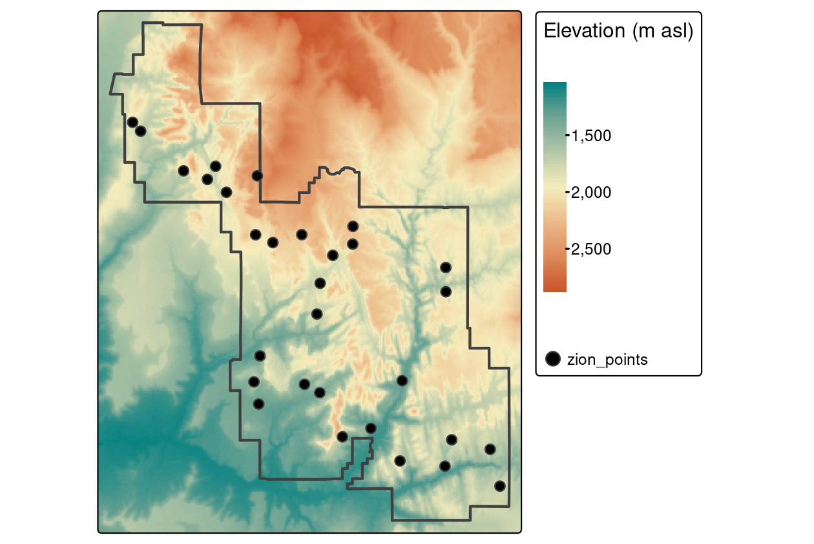

# ラスタとベクタの相互作用  {#raster-vector}


## 必須パッケージ  {- #prerequisites-06}

この章では、以下のパッケージが必要である。


``` r
library(sf)
library(terra)
library(dplyr)
```

## イントロダクション  {#introduction-06}

\index{らすた・べくたそうごさよう@ラスタ・ベクタ相互作用} 
この章では、Chapter \@ref(spatial-class) で紹介したラスタとベクタの地理データモデル間の相互作用に焦点を当てる。
主要な技法をいくつか紹介する。
最初は、ベクタオブジェクトを使用したラスタの切り落とし (crop) とマスク (mask) から始める (Section \@ref(raster-cropping))。
次に、さまざまな種類のベクタデータを使ってラスタ値を抽出する (Section \@ref(raster-extraction))。
最後は、ラスタベクタ変換である (Section \@ref(rasterization) と Section \@ref(spatial-vectorization))。
以上の概念を、実世界でどのように応用できるかを理解するため、これまでの章で使用したデータを用いて実際に操作していく。

## ラスタの切り落とし (crop)  {#raster-cropping}

\index{らすた@ラスタ!きりおとし@切り落とし (crop)}
多くの地理データプロジェクトでは、リモートセンシング画像 (ラスタ) や行政境界線 (ベクタ) など、さまざまなソースからのデータを統合している。
入力されたラスタデータセットの範囲は、対象地域よりも大きいことがよくある。
この場合、入力データの空間的な広がりを統一するために、ラスタの**切り落とし** (crop) や**マスク** (mask) が有効である。
この 2 つの処理により、オブジェクトのメモリ使用量と、その後の解析に必要な計算資源を削減できる。ラスタデータを含む魅力的な地図を作成する際に必要な前処理工程となる場合がある。

ここでは、2 つのオブジェクトを使ってラスタ切り落としを説明する。

- `SpatRaster` のオブジェクト `srtm` は、米国 Utah 州南西部の標高 (海抜メートル) を表す。
- ベクタ (`sf`) オブジェクト `zion` は、Zion 国立公園 (Zion National Park) を表す。

ターゲットと切り取りオブジェクトの両方が同じ投影である必要がある。
したがって、以下のコードは Chapter \@ref(spatial-class) でインストールされた **spDataLarge** パッケージからデータセットを読み込むだけでなく、`zion` を「再投影」している (この話題は Chapter \@ref(reproj-geo-data) で取り上げている)。


``` r
srtm = rast(system.file("raster/srtm.tif", package = "spDataLarge"))
zion = read_sf(system.file("vector/zion.gpkg", package = "spDataLarge"))
zion = st_transform(zion, st_crs(srtm))
```

`srtm` のラスタを切り出すために **terra** パッケージの `crop()` を使用する。
この関数は、第 1 引数に渡されたオブジェクトの矩形範囲を、第 2 引数に渡されたオブジェクトの範囲に縮小する。
つまり、以下のコマンドで Figure \@ref(fig:cropmask) (B) を生成する。


``` r
srtm_cropped = crop(srtm, zion)
```

\index{らすた@ラスタ!ますく@マスク} 
`crop()` に関連するものとして、**terra** 関数 `mask()` がある。これは第 2 引数に渡されたオブジェクトの境界外の値を `NA` に設定するものである。
したがって、次のコマンドは、Zion 国立公園の境界の外側のすべてのセルをマスクする (Figure \@ref(fig:cropmask) (C))。


``` r
srtm_masked = mask(srtm, zion)
```

`crop()` と `mask()` は、一緒に使うことが多い。
(a) ラスタの範囲を目的の領域に限定し、(b) 領域外の値をすべて NA に置き換える。^[ここで示した二つの操作は `terra::crop(srtm, zion, mask = TRUE)` と一つにまとめることもできる。理解しやすくするために二つに分けた。]


``` r
srtm_cropped = crop(srtm, zion)
srtm_final = mask(srtm_cropped, zion)
```

`mask()` の設定を変更すると、異なる結果が得られる。
`inverse = TRUE` を設定すると、公園の境界の<u>内側</u>をすべてマスクする (詳細は `?mask` を参照) (Figure \@ref(fig:cropmask) (D))。また、`updatevalue = 0` を設定すると、国立公園外のすべてのピクセルが 0 に設定される。


``` r
srtm_inv_masked = mask(srtm, zion, inverse = TRUE)
```

<div class="figure" style="text-align: center">

<p class="caption">(\#fig:cropmask)ラスタクロップ、ラスタマスク。</p>
</div>

## ラスタ抽出  {#raster-extraction}

\index{らすた@ラスタ!ちゅうしゅつ@抽出} 
ラスタ抽出は、地理的 (通常はベクタ) な「範囲選択」オブジェクトに基づいて、特定の位置の「ターゲット」ラスタに関連する値を識別して返す処理である。
結果は、使用する範囲選択の種類 (点、線、ポリゴン) と、`terra::extract()` 関数に渡される引数に依存する。
ラスタ抽出の逆、つまりベクタオブジェクトに基づいてラスタセル値を割り当てるのがラスタ化で、Section \@ref(rasterization) で説明する。

\index{らすた@ラスタ!ちゅうしゅつてん@抽出 点}
基本的な例として、ラスタセルの特定の**点**の値を抽出してみよう。
そのために、Zion 国立公園内の 30 カ所のサンプルを収録した `zion_points` を使用する (Figure \@ref(fig:pointextr))。 
次のコマンドは、`srtm` から標高値を抽出し、各ポイントの ID (ベクタの行ごとに 1 つの値) と関連する `srtm` の値を含むデータフレームを作成する。
さて、出来上がったオブジェクトを `cbind()` 関数で `zion_points` データセットに追加してみよう。 


``` r
data("zion_points", package = "spDataLarge")
elevation = terra::extract(srtm, zion_points)
zion_points = cbind(zion_points, elevation)
```


<div class="figure" style="text-align: center">

<p class="caption">(\#fig:pointextr)ラスタ抽出に使用した点の位置。</p>
</div>

\index{らすた@ラスタ!ちゅうしゅつせん@抽出 線}
ラスタ抽出は、**線**範囲選択でも機能する。
そして、線に接するラスタセルごとに 1 つの値を抽出する。
しかし、抽出されたラスタ値の各ペア間の距離を正しく取得することが難しいため、線の断片に沿った値を得るための線抽出アプローチは推奨されていない。

この場合、線を多くの点に分割し、その点の値を抽出するのが良い方法である。
これを示すために、以下のコードでは、Figure \@ref(fig:lineextr) (A) に示した Zion 国立公園の北西から南東に向かう直線、`zion_transect` を作成する (ベクタデータモデルについての復習は Section \@ref(vector-data) を参照)。


``` r
zion_transect = cbind(c(-113.2, -112.9), c(37.45, 37.2)) |>
  st_linestring() |> 
  st_sfc(crs = crs(srtm)) |>
  st_sf(geometry = _)
```


線の範囲選択から高さを抽出することの有用性は、ハイキングの計画を立てることを想像してみるとよくわかる。
以下に示す方法は、ルートの「標高プロファイル」を提供し (線は直線である必要はない)、長い上り坂による所要時間を見積もるのに便利である。

まず、各断片に固有の `id` を追加する。
次に、`st_segmentize()` 関数を使って、与えられた密度 (`dfMaxLength`) で線に沿って点を追加し、`st_cast()` で点に変換することができる。


``` r
zion_transect$id = 1:nrow(zion_transect)
zion_transect = st_segmentize(zion_transect, dfMaxLength = 250)
zion_transect = st_cast(zion_transect, "POINT")
```

これで大きな点の集合ができたので、断片の最初の点と、それ以降の各点との距離を導き出してみたい。 
このケースでは、1 つの断片しかないが、原理的には、このコードはいくつの断片でも動作するはずである。


``` r
zion_transect = zion_transect |> 
  group_by(id) |> 
  mutate(dist = st_distance(geometry)[, 1]) 
```

最後に、断片の各ポイントの標高値を抽出し、この情報をメインオブジェクトに結合する。


``` r
zion_elev = terra::extract(srtm, zion_transect)
zion_transect = cbind(zion_transect, zion_elev)
```

その結果、`zion_transect`、Figure \@ref(fig:lineextr) (B) に示すように、標高プロファイルを作成することができる。

<div class="figure" style="text-align: center">

<p class="caption">(\#fig:lineextr)ラスタ抽出に使用した線の位置 (A) と、その線に沿った標高 (B)。</p>
</div>

\index{らすた@ラスタ!ちゅうしゅつぽりごん@抽出 ポリゴン}
ラスタ抽出のための地理ベクタオブジェクトの最後のタイプは、**ポリゴン**である。
線と同様に、ポリゴンも 1 ポリゴンあたり多くのラスタ値を返す傾向がある。
これは以下のコマンドで示され、`ID` (ポリゴンの行番号) と `srtm`  (関連する標高値) の列名を持つデータフレームが生成される。


``` r
zion_srtm_values = terra::extract(x = srtm, y = zion)
```

このような結果を利用して、ポリゴンごとのラスタ値の要約統計量を生成することで、例えば、単一の地域を特徴付けることや、多くの地域を比較することができる。
これは以下のコードで示されている。このコードは、Zion 国立公園の標高値の要約統計を含むオブジェクト `zion_srtm_df` を作成する (Figure \@ref(fig:polyextr) (A) を参照)。


``` r
group_by(zion_srtm_values, ID) |> 
  summarize(across(srtm, list(min = min, mean = mean, max = max)))
#> # A tibble: 1 × 4
#>      ID srtm_min srtm_mean srtm_max
#>   <dbl>    <int>     <dbl>    <int>
#> 1     1     1122     1818.     2661
```

上のコードチャンクは、Chapter \@ref(attr) で説明されているように、ポリゴン ID ごとのセル値の要約統計を提供するために **dplyr**\index{dplyr (package)} を使用した。
その結果、例えば公園の最高標高が海抜約 2,661 m であることなど、有用な要約が得られる (標準偏差など、他の要約統計もこの方法で計算できる)。
この例ではポリゴンが 1 つしかないので 1 行のデータフレームだが、複数の範囲選択ポリゴンが使用されている場合にも動作する。

同様のアプローチは、ポリゴン内のカテゴリ的なラスタ値の出現をカウントする場合にも有効である。
これは、Figure \@ref(fig:polyextr) (B) の **spDataLarge** パッケージの土地被覆データセット (`nlcd`) を使って説明され、以下のコードで実証されている。


``` r
nlcd = rast(system.file("raster/nlcd.tif", package = "spDataLarge"))
zion2 = st_transform(zion, st_crs(nlcd))
zion_nlcd = terra::extract(nlcd, zion2)
zion_nlcd |> 
  group_by(ID, levels) |>
  count()
#> # A tibble: 7 × 3
#> # Groups:   ID, levels [7]
#>      ID levels         n
#>   <dbl> <fct>      <int>
#> 1     1 Developed   4205
#> 2     1 Barren     98285
#> 3     1 Forest    298299
#> 4     1 Shrubland 203701
#> # ℹ 3 more rows
```

<div class="figure" style="text-align: center">

<p class="caption">(\#fig:polyextr)(A) 連続 と (B) カテゴリのラスタ抽出に使用した範囲。</p>
</div>

\index{らすた@ラスタ!ちゅうしゅつわりあい@抽出割合}
**terra** パッケージはポリゴン内のラスタ値を高速に抽出するが、`extract()` は大きなポリゴンデータセットを処理する際のボトルネックになることがある。
**exactextractr** パッケージは、`exact_extract()` 関数を通してピクセル値を抽出するための [高速の代替手段](https://github.com/geocompx/geocompr/issues/813)を提供する。
また、`exact_extract()` 関数は、デフォルトで、ポリゴンによってオーバーラップされた各ラスタセルの割合を計算し、より正確である (詳細については、以下の注を参照)。

\BeginKnitrBlock{rmdnote}<div class="rmdnote">ポリゴンは通常不規則な形状をしているため、ラスタのセルの一部にしか重ならないことがある。
より詳細な結果を得るために、`terra::extract()` 関数には `exact` と呼ばれる引数がある。
`exact = TRUE` とすると、出力データフレームに `fraction` という列が追加され、ポリゴンによってカバーされる各セルの割合を表す。
これは例えば、連続ラスタの加重平均や、カテゴリラスタのより正確なカバレッジを計算するのに便利である。
デフォルトでは、この操作はより多くの計算を必要とするため、`FALSE` に設定されている。
`exactextractr::exact_extract()` 関数は、常に各セルにおけるポリゴンの被覆率を計算する。</div>\EndKnitrBlock{rmdnote}


## ラスタ化  {#rasterization}

\index{らすたか@ラスタ化} 
ラスタ化とは、ベクタオブジェクトをラスタオブジェクトに変換して表現することである。
通常、出力されたラスタは定量的な解析 (地形の解析など) やモデリングに利用される。
Chapter \@ref(spatial-class) で見たように、手法によってはラスタデータモデルの方が適していることがある。
さらに、ラスタ化は地理的なデータ集計の一種と考えることができ、結果として得られる値はすべて同じ空間分解能を持つため、データセットを簡素化することができる。

**terra** パッケージには、この作業を行うための関数 `rasterize()` が含まれている。
その最初の 2 つの引数は、ラスタ化されるベクタオブジェクト `x` とテンプレートラスタ `y`である。後者は、出力の範囲、解像度、CRS を定義するラスタである。
入力ラスタの地理的解像度が低すぎる (セルサイズが大きすぎる) と、ベクタデータの地理的変動を完全に見逃す可能性があり、高すぎる場合は計算時間がかかりすぎる可能性がある。
適切な地理的解像度を決定する際に従うべき単純なルールはなく、結果の使用目的によって大きく左右される。
例えば、ラスタ化の出力を他の既存ラスタに合わせる必要がある場合など、ターゲット解像度がユーザーに課されることがよくある。

\index{らすたか@ラスタ化!!points}
ラスタ化を実演するために、入力ベクタデータ `cycle_hire_osm_projected` (ロンドンの自転車レンタルポイントに関するデータセットを Figure \@ref(fig:vector-rasterization1) (A) に図示) と同じ範囲と CRS、空間解像度 1000 メートルのテンプレートラスタを使用することにする。


``` r
cycle_hire_osm = spData::cycle_hire_osm
cycle_hire_osm_projected = st_transform(cycle_hire_osm, "EPSG:27700")
raster_template = rast(ext(cycle_hire_osm_projected), resolution = 1000,
                       crs = crs(cycle_hire_osm_projected))
```

ラスタ化は非常に柔軟な操作で、結果はテンプレートとなるラスタの性質だけでなく、入力ベクタの種類 (点、ポリゴンなど) や、`rasterize()` 関数が取るさまざまな引数に依存する。

この柔軟性を説明するために、3 つの異なるアプローチでラスタ化を試みる。
まず、レンタルサイクルの有無を表すラスタ (有無ラスタと呼ぶ) を作成する。
この場合、`rasterize()` は、`x` と `y` (前述のベクタとラスタのオブジェクト) のみを要求する (図示の結果 Figure \@ref(fig:vector-rasterization1) (B))。


``` r
ch_raster1 = rasterize(cycle_hire_osm_projected, raster_template)
```

`fun` 引数は、近接した複数の観測値をラスタオブジェクトの関連セルに変換するために使用される要約統計量を指定する。
デフォルトでは、`fun = "last"` が使用されるが、`fun = "length"` などの他のオプションも使用できる。この場合、各グリッドセル内のレンタルサイクルのステーション数をカウントする (この操作の結果は、Figure \@ref(fig:vector-rasterization1) (C) に示す)。


``` r
ch_raster2 = rasterize(cycle_hire_osm_projected, raster_template, 
                       fun = "length")
```

新しい出力である `ch_raster2` は、各グリッドセル内のレンタルサイクルのステーション数を示している。
レンタルサイクルのステーションは、`capacity` 変数で記述される自転車の数が異なるため、各グリッドセルの収容台数 (`capacity`) はどの程度なのかという疑問が生じる。
これを計算するためには、フィールド (`"capacity"`) を `sum` することが必要で、その結果、Figure \@ref(fig:vector-rasterization1) (D) のような出力が得られる。以下のコマンドで計算する (`mean` など他の要約関数も使用できる)。


``` r
ch_raster3 = rasterize(vect(cycle_hire_osm_projected), raster_template, 
                       field = "capacity", fun = sum, na.rm = TRUE)
```

<div class="figure" style="text-align: center">

<p class="caption">(\#fig:vector-rasterization1)点のラスタ化例。</p>
</div>

\index{らすたか@ラスタ化!!せん@線} 
\index{らすたか@ラスタ化!ぽりごん@ポリゴン} 
また、カリフォルニア州のポリゴンと境界線をベースにしたデータセット (下記作成) は、線のラスタ化を表している。
ポリゴンオブジェクトを複合線にキャストした後、0.5 度の分解能を持つテンプレートラスタを作成する。


``` r
california = dplyr::filter(us_states, NAME == "California")
california_borders = st_cast(california, "MULTILINESTRING")
raster_template2 = rast(ext(california), resolution = 0.5,
                        crs = st_crs(california)$wkt)
```

線またはポリゴンのラスタ化を考慮する場合、有用な追加引数の 1 つは `touches` である。
デフォルトでは `FALSE` であるが、`TRUE` に変更すると、線またはポリゴンの境界で接触しているすべてのセルが値を得る。
`touches = TRUE` による線のラスタ化を以下のコードで実行する (Figure \@ref(fig:vector-rasterization2) (A))。


``` r
california_raster1 = rasterize(california_borders, raster_template2,
                               touches = TRUE)
```

ポリゴンのラスタ化と比較すると、`touches = FALSE` がデフォルトで、Figure \@ref(fig:vector-rasterization2) (B) に示すように、範囲選択ポリゴン内に中心点があるラスタセルのみが選択されることになる。


``` r
california_raster2 = rasterize(california, raster_template2) 
```

<div class="figure" style="text-align: center">

<p class="caption">(\#fig:vector-rasterization2)線とポリゴンのラスタ化の例。</p>
</div>

## 空間ベクタ化  {#spatial-vectorization}

\index{くうかんべくたか@空間ベクタ化} 
空間ベクタ化は、ラスタ化 (Section \@ref(rasterization)) と対で、方向が逆になる。
空間的に連続したラスタデータを、点、線、ポリゴンなどの空間的に離散したベクタデータに変換する。

\BeginKnitrBlock{rmdnote}<div class="rmdnote">表現に注意。
R では通常、単にベクトル化と言った場合、`for` ループなどを `1:10 / 2` のように置き換えることができるようにすることを指す (@wickham_advanced_2019 参照)。</div>\EndKnitrBlock{rmdnote}

\index{くうかんべくたか@空間ベクタ化!てん@点}
最も単純なベクタ化は、ラスタセルの中心を点に変換することである。
`as.points()` は、`NA` 以外のすべてのラスタグリッドセルに対して実行する (Figure \@ref(fig:raster-vectorization1))。
なお、ここでは、`st_as_sf()` を使って、結果のオブジェクトを `sf` クラスに変換することもしている。


``` r
elev = rast(system.file("raster/elev.tif", package = "spData"))
elev_point = as.points(elev) |> 
  st_as_sf()
```

<div class="figure" style="text-align: center">

<p class="caption">(\#fig:raster-vectorization1)elev オブジェクトのラスタ表現と点表現。</p>
</div>

\index{くうかんべくたか@空間ベクタ化!とうこうせん@等高線}
空間ベクタ化のもう一つの一般的なタイプは、例えば連続した高さや温度の線 (等温線) を表す等高線の作成である。
ここでは、実世界のデジタル標高モデル (DEM) を使用する。というのも、人工のラスタ `elev` は平行線を生成するためである (読者への課題: これを検証し、なぜこうなるのかを説明しなさい)。
等高線は **terra** 関数 `as.contour()` で作成することができる。この関数は、R に元々ある `filled.contour()` のラッパーである (図示せず)。


``` r
dem = rast(system.file("raster/dem.tif", package = "spDataLarge"))
cl = as.contour(dem) |> 
  st_as_sf()
plot(dem, axes = FALSE)
plot(cl, add = TRUE)
```

`contour()` や `rasterVis::contourplot()` などの関数で、既存のプロットに等高線を追加することもできる。
<!--`tmap::tm_iso() -->
Figure \@ref(fig:contour-tmap) に示すように、等値線 (isoline) にはラベルを付けることができる。

\index{hillshade}

<div class="figure" style="text-align: center">

<p class="caption">(\#fig:contour-tmap)モンゴル山南麓の等高線を重ねた陰影付きデジタル標高モデル。</p>
</div>

\index{くうかんべくたか@空間ベクタ化!ぽりごん@ポリゴン}
ベクタ化の最後のタイプとして、ラスタをポリゴンに変換しよう。
これには、`terra::as.polygons()` を使う。各ラスタセルを 5 つの座標からなるポリゴンに変換し、そのすべてがメモリに保存される (ラスタがベクタと比較して高速であることが多い理由が分かる!)。

以下では、`grain` オブジェクトをポリゴンに変換し、その後、同じ属性値を持つポリゴン間の境界を解消することで説明している (`as.polygons()` の `dissolve` の引数も参照)。


``` r
grain = rast(system.file("raster/grain.tif", package = "spData"))
grain_poly = as.polygons(grain) |> 
  st_as_sf()
```

<div class="figure" style="text-align: center">

<p class="caption">(\#fig:06-raster-vector-40)ラスタ (A)のベクタ化 (B) ポリゴン (dissolve = FALSE; 中央) と融合ポリゴン (dissolve = TRUE)。</p>
</div>

`grain` データセットのポリゴンは、長方形のピクセルをつなぐことで定義される直方体の境界を持つ。
ポリゴンを滑らか (smooth) にするために、Chapter \@ref(geometry-operations) のパッケージ **smoothr** を使用することができる。
平滑化処理はポリゴン境界の鋭いエッジを除去するため、平滑化ポリゴンは元のピクセルとは空間的範囲が正確に同じにはならない。
そのため、平滑化されたポリゴンをさらに解析に使用する場合は注意が必要となる。

## 演習


以下の演習では、**spDataLarge** パッケージのベクタデータ (`zion_points`) とラスタデータ (`srtm`) を使うことがある。
まず、ベクタデータ (`ch`) から、ポリゴンの「凸多面体」で領域を示す。

``` r
library(sf)
library(terra)
library(spData)
zion_points_path = system.file("vector/zion_points.gpkg", package = "spDataLarge")
zion_points = read_sf(zion_points_path)
srtm = rast(system.file("raster/srtm.tif", package = "spDataLarge"))
ch = st_combine(zion_points) |>
  st_convex_hull() |> 
  st_as_sf()
```

E1. `srtm` ラスタを、 (1) `zion_points`と (2) `ch` のデータセットを使い切り落とし (crop) なさい。
作成した地図に違いはあるか？
次に、同じデータセットを使い `srtm` をマスクしなさい。
何か違いはあるか?
その違いを説明できるか?


E2. まず、`zion_points` で表される点の `srtm` から値を抽出しなさい。
次に、`zion_points` の各点を 90 個のバッファで囲んで `srtm` の平均値を抽出し、この 2 つの値を比較しなさい。
バッファによる値の抽出は、点のみによる抽出よりもどのような場合に適しているだろうか?

- ボーナス:  **exactextractr**パッケージを使用して抽出を実行し、結果を比較しなさい。


E3. New Zealand の標高 3100 m 以上のポイント (`nz_height`オブジェクト) の部分集合を作成し、新しい点データセットの範囲に対して解像度 3 km のテンプレートラスタを作成しなさい。
これら 2 つの新しいオブジェクトを使い、

- 各グリッドセルで最も標高の高い点の数を数えなさい。
- 各グリッドセル内の最大標高を求めなさい。


E4. New Zealand の高地の位置を数えるラスタ (前のエクササイズで作成) を集約し、その地理的解像度を半分に下げ (セルが 6 * 6 km になるように)、結果をプロットしなさい。

- 低解像度のラスタを元の解像度 3 km に再サンプルしなさい。結果はどう変わったか?
- ラスタの解像度を下げることの利点と欠点を 2 つ挙げなさい。


E5. `grain` データセットをポリゴンにして、土を表している正方形をフィルタしなさい。


- ベクタデータがラスタデータよりも良い点と悪い点を挙げなさい。
- ラスタをベクタに変換すると良いのはどのような時か？
