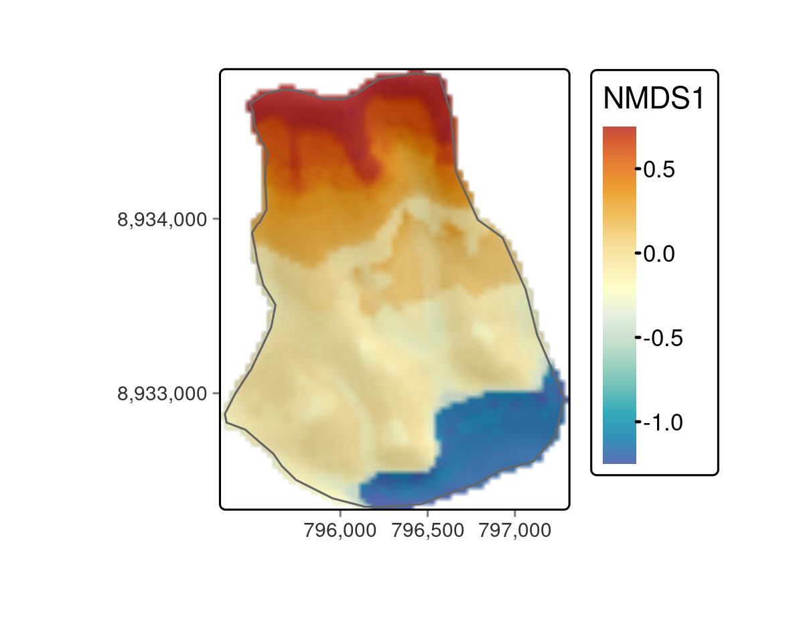

# 生態学  {#eco}


## 必須パッケージ  {- #prerequisites-15}

この章では、Chapter \@ref(spatial-class) ～ Chapter \@ref(geometry-operations) で説明した地理データ解析と処理について十分に理解していることを前提に説明する。
また、Chapters \@ref(gis) と Chapter \@ref(spatial-cv) で解説した GIS へのブリッジと空間交差検証 (cross-validation, CV)\index{こうさけんしょう@交差検証!くうかんこうさけんしょう@空間交差検証} も活用していこう。

この章では、以下のパッケージを使用する。


``` r
library(sf)
library(terra)
library(dplyr)
library(data.table)        # 高速な data_frame 操作 (mlr3 が使用)
library(mlr3)              # 機械学習 (Chapter 12 参照)
library(mlr3spatiotempcv)  # 時空間リサンプリング
library(mlr3tuning)        # ハイパーパラメータのチューニング
library(mlr3learners)      # 最重要の機械学習へのインターフェース
library(paradox)           # ハイパーパラメータ空間を定義
library(ranger)            # ランダムフォレスト
library(qgisprocess)       # QGIS へのブリッジ (Chapter 10)
library(tree)              # 決定木
library(vegan)             # 生態学
```

## イントロダクション  {#introduction-15}

本章では、霧のオアシスの植生勾配をモデル化し、水の利用可能性に明らかに支配されている特徴的な植生帯を明らかにする。
ケーススタディでは、R におけるジオコンピュテーションスキルを磨くため、これまでの章で紹介した概念をまとめ、さらに拡張していく。

霧のオアシスは、地元では**ロマ植生**と呼ばれ、Peru や Chile の海岸砂漠に沿った山々に発達している。
同様の植生形態は、Namibia や Yemen、Oman の海岸沿いなど他の地域でも見られる [@galletti_land_2016]。
年間の降水量平均は 30〜50 mm 程度であり乾燥した条件にもかかわらず、霧の発生により、南半球の冬の間に植物が利用できる水量が増加する。
その結果、Peru の海岸線に沿った南向きの山の斜面が緑色になる (Figure \@ref(fig:study-area-mongon))。 
数年に一度、エルニーニョ現象によって、この太陽の降り注ぐ環境に集中豪雨がもたらされ、苗木はその後の乾燥した環境を生き抜くための根を長く張るチャンスを得ることができる [@dillon_lomas_2003]。

残念ながら、霧のオアシスは、主に人間の活動により、大きく危機に瀕している。
残されたユニークな植生生態系を効果的に保護するためには、原生植物相の構成と空間分布に関するエビデンスが必要である [@muenchow_predictive_2013; @muenchow_soil_2013]。

この章では、Peru の中央北岸に位置する Casma 近郊の**ロマ植生**山である Mongón 山の南斜面における維管束植物 (ここでは主に顕花植物) の組成と空間分布を分析する (Figure \@ref(fig:study-area-mongon))。
Mongón 山での野外調査において、2011年の冬に無作為にサンプリングした 4 x 4 m^2^ の 100 区画に生息する維管束植物をすべて記録した [@muenchow_predictive_2013]。
このサンプリングは、米国海洋大気庁 ([NOAA](https://origin.cpc.ncep.noaa.gov/products/analysis_monitoring/ensostuff/ONI_v5.php)) が発表したデータに示されているように、その年の強いラニーニャ現象が発生した時期と重なった。
このため、沿岸部の砂漠では例年よりもさらに高いレベルの乾燥が発生し、Peru の**ロマ植生**山脈の南斜面では霧の活動が活発化した。

<div class="figure" style="text-align: center">

<p class="caption">(\#fig:study-area-mongon)Mongón 山調査地。Muenchow, Schratz, and Brenning (2017) の図。</p>
</div>

また本章では、前章で扱ったテクニックを、重要な応用分野である生態学に応用する方法を示す。
具体的には、

- 必要なデータを読み込み、環境予測因子を計算する (Section \@ref(data-and-data-preparation))
- 次元削減技術 (座標付け; Section \@ref(nmds)) を用いて、種組成行列から主な植物学的勾配を抽出する\index{じげんさくげんぎじゅつ@次元削減技術}
- 最初の順序軸、すなわち植物相勾配を、標高、傾斜、集水域、NDVI などの環境予測変数の関数としてモデル化する (Section \@ref(modeling-the-floristic-gradient))\index{ざひょうづけ@座標付け}\index{しゅうすいいき@集水域}\index{NDVI}
そのために、ランダムフォレストモデルを利用する。機械学習アルゴリズム [@breiman_random_2001]の 1 つである。最適な予測を行うために、空間交差検証を用いて、ハイパーパラメータを事前に調整することが望ましい (see Section \@ref(svm))\index{らんだむふぉれすと@ランダムフォレスト}\index{きかいがくしゅう@機械学習}\index{はいぱーぱらめーた@ハイパーパラメータ}\index{こうさけんしょう@交差検証!くうかんてき@空間的 CV}
- 調査地内の任意の場所の植物組成の空間分布図を作成する (Section \@ref(predictive-mapping))

## データとデータ準備  {#data-and-data-preparation}

以降の解析に必要なデータは、**spDataLarge** パッケージから入手可能である。


``` r
data("study_area", "random_points", "comm", package = "spDataLarge")
dem = rast(system.file("raster/dem.tif", package = "spDataLarge"))
ndvi = rast(system.file("raster/ndvi.tif", package = "spDataLarge"))
```

`study_area` は調査地域の外形を表すポリゴン、`random_points` はランダムに選ばれた 100 地点を含む `sf` オブジェクトである。
`comm` はワイドデータ形式の群集行列で、行はフィールドで訪問した場所、列は観察された種を表している。^[統計学では、分割表やクロス表とも呼ばれる。]


``` r
# サイト 35 から 40 と、それに対応する群集マトリックスの
# 最初の 5 種の発生状況
comm[35:40, 1:5]
#>    Alon_meri Alst_line Alte_hali Alte_porr Anth_eccr
#> 35         0         0         0       0.0     1.000
#> 36         0         0         1       0.0     0.500
#> 37         0         0         0       0.0     0.125
#> 38         0         0         0       0.0     3.000
#> 39         0         0         0       0.0     2.000
#> 40         0         0         0       0.2     0.125
```

数値はサイトごとの種の被度を表し、サイト面積に対する種の被度の割合 (%; ひとつのサイトでは、個々の植物間の被度の重複により 100% を超える場合があることに注意) で記録された。
`comm` の列名は `random_points` の `id` 列に対応する。
`dem` は調査地域の数値標高モデル (digital elevation model, DEM\index{でじたるひょうこうもでる@デジタル標高モデル}) で、`ndvi` は Landsat シーンの赤色および近赤外チャネルから算出した正規化植生指標 (Normalized Difference Vegetation Index, NDVI) である (Section \@ref(local-operations) および `?spDataLarge::ndvi.tif` を参照)。
Figure \@ref(fig:sa-mongon) に示すように、`dem` に `random_points` と `study_area` を重ねて表示すことで、データをより身近なものにすることができる。

\index{hillshade}

<div class="figure" style="text-align: center">

<p class="caption">(\#fig:sa-mongon)スタディマスク (ポリゴン)、サンプリング地点 (黒点)、背景の DEM。</p>
</div>

次のステップは、モデリングと予測地図作成に必要な変数 (Section \@ref(predictive-mapping) 参照) だけでなく、非計量多次元尺度構成法 (Non-Metric Multidimensional Scaling, NMDS\index{NMDS}) 軸を調査地域の主要勾配、高度と湿度にそれぞれ整合させるための変数も計算することである (Section \@ref(nmds) 参照)。

具体的には、R-GIS ブリッジを用いて、デジタル標高モデル\index{でじたるひょうこうもでる@デジタル標高モデル}から集水勾配と集水面積\index{きゃっちめんとえりあ@キャッチメントエリア}を計算する (Chapter \@ref(gis) 参照)。
曲率も重要な予測因子である可能性があり、「演習」セクションで、それらがモデリング結果にどのような影響を与えるかを確認することができる。

集水域\index{しゅうすいいきあ@集水域}と集水勾配を計算するには、`sagang:sagawetnessindex` 関数を利用することができる。^[残念ながら、`sagawetnessindex` で望ましい地形属性を計算するには SAGA\index{SAGA} に詳しくなければならない。] 
`qgis_show_help()` 特定のジオアルゴリズム\index{じおあるごりずむ@ジオアルゴリズム}のすべての関数\index{かんすう@関数}パラメータとデフォルト値を返す。
ここでは、その一部のみを紹介する。


``` r
# saga next generation プラグインを有効化していない場合に有効化
qgisprocess::qgis_enable_plugins("processing_saga_nextgen")
# ヘルプを表示
qgisprocess::qgis_show_help("sagang:sagawetnessindex")
#> Saga wetness index (saga:sagawetnessindex)
#> ...
#> ----------------
#> Arguments
#> ----------------
#> 
#> DEM: Elevation
#> 	Argument type:	raster
#> 	Acceptable values:
#> 		- Path to a raster layer
#> ...
#> SLOPE_TYPE: Type of Slope
#> 	Argument type:	enum
#> 	Available values:
#> 		- 0: [0] local slope
#> 		- 1: [1] catchment slope
#> ...
#> AREA: Catchment area
#> 	Argument type:	rasterDestination
#> 	Acceptable values:
#> 		- Path for new raster layer
#>... 
#> ----------------
#> Outputs
#> ----------------
#> 
#> AREA: <outputRaster>
#> 	Catchment area
#> SLOPE: <outputRaster>
#> 	Catchment slope
#> ...
```

次に、R の名前付き引数を使って、必要なパラメータを指定する (Section \@ref(rqgis) を参照)。
ディスク上のファイルへのパス、あるいは R\index{R} のグローバル環境にある `SpatRaster` を使って、入力ラスタ `DEM` を指定できることを思い出そう (Section \@ref(rqgis) 参照)。
`SLOPE_TYPE` に 1 を指定することで、アルゴリズムが集水勾配を返すようになる。
生成されたラスタ\index{らすた@ラスタ}は、SAGA\index{SAGA} のラスタ形式である `.sdat` という拡張子で一時ファイルに保存される。


``` r
# 環境予測因子: 集水勾配と集水面積
ep = qgisprocess::qgis_run_algorithm(
  alg = "sagang:sagawetnessindex",
  DEM = dem,
  SLOPE_TYPE = 1, 
  SLOPE = tempfile(fileext = ".sdat"),
  AREA = tempfile(fileext = ".sdat"),
  .quiet = TRUE)
```

これは、計算された出力ラスタへのパスを含む `ep` という名前のリストを返す。
集水域と集水勾配を多層構造 `SpatRaster` オブジェクトに読み込んでみよう (Section \@ref(raster-classes) 参照)。
さらに、これに 2 つのラスタオブジェクト `dem` と `ndvi` を追加する。


``` r
# 集水域と集水勾配を読み取る
ep = ep[c("AREA", "SLOPE")] |>
  unlist() |>
  rast()
names(ep) = c("carea", "cslope") # 名前をわかりやすく変更
origin(ep) = origin(dem) # ラスタが同じ原点を持つことを確認
ep = c(dem, ndvi, ep) # 多層 SpatRaster オブジェクトに dem と ndvi を追加する。
```

さらに、集水域\index{しゅうすいいき@集水域} の値は右側に大きく偏っている (`hist(ep$carea)`)。
常用対数変換をすると、より正規分布に近くなる。


``` r
ep$carea = log10(ep$carea)
```

読者の便宜を図るため、**spDataLarge** に `ep` を追加した。


``` r
ep = rast(system.file("raster/ep.tif", package = "spDataLarge"))
```

最後に、現地観測に地形属性を抽出することができる (Section \@ref(raster-extraction) も参照)。


``` r
ep_rp = terra::extract(ep, random_points, ID = FALSE)
random_points = cbind(random_points, ep_rp)
```

## 次元性を低減  {#nmds}

座標付け (Ordination\index{ざひょうづけ@座標付け}) は、植生学において、0 で埋め尽くされた大規模な種間プロット行列から主要情報 (生態的勾配に相当することが多い) を抽出するための一般的なツールである。 
しかし、リモートセンシング\index{りもーとせんしんぐ@リモートセンシング}、土壌学、ジオマーケティング\index{しょうけんぶんせき@商圏分析} などの分野でも利用されている。
座標付け\index{ざひょうづけ@座標付け}テクニックに馴染みがない場合、または復習が必要な場合は、生態学で人気の座標付けテクニックを簡単に紹介した [Michael W. Palmer のウェブページ](https://ordination.okstate.edu/overview.htm) と R でこれらのテクニックを適用する方法について深く調べた @borcard_numerical_2011 に目を通してみよう。 
**vegan**\index{vegan (package)} のパッケージのドキュメントも非常に有用なリソースである (`vignette(package = "vegan")`)。

主成分分析 (principal component analysis, PCA\index{しゅせいぶんぶんせき@主成分分析}) は、おそらく最も有名な座標付け \index{ざひょうづけ@座標付け}の手法である。 
変数間の線形関係が期待でき、2 つのプロット (観測) における変数の共同不在が類似性とみなせる場合、次元を削減するためのすばらしいツールである。
これは植生データではほとんどない。

ひとつは、植物の存在は通常、勾配 (湿度、温度、塩分など) に沿って、最も好ましい条件でピークを迎え、好ましくない条件に向かって減少していくという単峰性の関係にある。 

第二に、ある種が 2 つの区画で同時に存在しないことは、類似性を示す指標とはなりにくい。
ある植物種が、サンプルの中で最も乾燥した場所 (例: 極度の砂漠) と最も湿った場所 (例: 木のサバンナ) から姿を消したとする。
というのも、この 2 つの全く異なる環境設定に共通するのは、 (稀少なユビキタス種を除いて) 種が存在しないという点だけである可能性が非常に高いからである。 

NMDS\index{NMDS} は、生態学でよく使われる次元削減手法の一つである [@vonwehrden_pluralism_2009]。
NMDS\index{NMDS} は、元の行列のオブジェクト間の距離と、座標付けられたオブジェクト間の距離の間のランクベースの差異を低減する。 
その差をストレスとして表現している。 
ストレス値が低いほど、座標付け、すなわち元の行列の低次元表現が良好であることを示す。
ストレス値が 10 より小さいと適合性が高く、15 程度でも良好、20 より大きいと適合性が低いことを表している [@mccune_analysis_2002]。
R では、**vegan**\index{vegan (package)} パッケージの `metaMDS()` で NMDS を実行することができる。
入力として、サイトを行、種を列とする群集行列を期待する。
しばしば、有-無データを用いた座標付け\index{ざひょうづけ@座標付け} は、 (説明される分散の点で) より良い結果をもたらするが、その代償として、もちろん、入力行列の情報量は少なくなる (演習も参照)。
`decostand()` は、数値の観測結果を、1 が種の発生、0 が種の不在を示す有無に変換する。
NMDS\index{NMDS} のようなオーダリング技術では、部位ごとに少なくとも 1 回の観測が必要である。
したがって、種が発見されなかったサイトはすべて除外する必要がある。


``` r
# 存在-不在 行列
pa = vegan::decostand(comm, "pa") # 100 行 (箇所) , 69 列 (種) 
# 1種以上発見されたサイトのみを残す
pa = pa[rowSums(pa) != 0, ]  # 84 行, 69 列 (種) 
```

得られた行列は、NMDS\index{NMDS} の入力として機能する。
`k` は出力軸数を指定し、ここでは 4 とする。 ^[
`k` を選択する一つの方法として、1 から 6 の間で `k` を試し、最も良いストレス値が得られる結果を使用する方法がある [@mccune_analysis_2002]。
]
NMDS\index{NMDS} は、各ステップで座標付けされた空間をより入力行列に近づけようとする反復的な手順である。
アルゴリズムの収束を確認するために、`try` パラメータを使ってステップ数を 500 に設定した。


``` r
set.seed(25072018)
nmds = vegan::metaMDS(comm = pa, k = 4, try = 500)
nmds$stress
#> ...
#> Run 498 stress 0.08834745 
#> ... Procrustes: rmse 0.004100446  max resid 0.03041186 
#> Run 499 stress 0.08874805 
#> ... Procrustes: rmse 0.01822361  max resid 0.08054538 
#> Run 500 stress 0.08863627 
#> ... Procrustes: rmse 0.01421176  max resid 0.04985418 
#> *** Solution reached
#> 0.08831395
```


ストレス値 9 は非常に良い結果を表し、縮小された座標付け空間が入力行列の分散の大部分を表していることを意味する。
全体として、NMDS\index{NMDS} は、座標付け空間において、(種の構成という点で) より類似したオブジェクトがより近くに配置される。
しかし、他の多くの座標付け \index{ざひょうづけ@座標付け}  の手法とは対照的に、軸は任意であり、必ずしも重要度 [@borcard_numerical_2011]  によって座標付けされるわけではない。
しかし、調査地では湿度が主な勾配を表していることが既に分かっている [@muenchow_predictive_2013;@muenchow_rqgis:_2017]。
湿度は標高と高い相関があるため、標高に応じて NMDS\index{NMDS} 軸を回転させる (NMDS 軸の回転の詳細については `?MDSrotate` も参照)。
結果をプロットしてみると、意図したとおり、第 1 軸は明らかに高度 (Figure \@ref(fig:xy-nmds)) と関連していることがわかる。


``` r
elev = dplyr::filter(random_points, id %in% rownames(pa)) |> 
  dplyr::pull(dem)
# 高度 (湿度の代理) に応じて NMDS を回転
rotnmds = vegan::MDSrotate(nmds, elev)
# 最初の2軸の抽出
sc = vegan::scores(rotnmds, choices = 1:2, display = "sites")
# 第1軸を高度にプロット
plot(y = sc[, 1], x = elev, xlab = "elevation in m", 
     ylab = "First NMDS axis", cex.lab = 0.8, cex.axis = 0.8)
```

<div class="figure" style="text-align: center">

<p class="caption">(\#fig:xy-nmds)NMDS の第1軸を高度に対してプロット。</p>
</div>


最初の NMDS\index{NMDS} 軸のスコアは、Mongón 山の斜面に沿って現れる異なる植生形態、すなわち植物学的勾配を表している。
それらを空間的に可視化するために、NMDS\index{NMDS} のスコアを先に作成した予測因子 (Section \@ref(data-and-data-preparation)) でモデル化し、得られたモデルを予測地図に利用する (Section \@ref(modeling-the-floristic-gradient) 参照) ことができる。

## 植物相の勾配をモデル化  {#modeling-the-floristic-gradient}

植物相の勾配を空間的に予測するために、ランダムフォレスト\index{らんだむふぉれすと@ランダムフォレスト}モデルを使用する。
ランダムフォレスト\index{らんだむふぉれすと@ランダムフォレスト}モデルは、環境・生態系のモデリングに頻繁に適用され、予測性能の面で最良の結果をもたらすことが多い [@hengl_random_2018;@schratz_hyperparameter_2019]。
ここで、これらはランダムフォレスト\index{らんだむふぉれすと@ランダムフォレスト}の基礎を形成するものであるため、決定木とバギングについて簡単に紹介する。
ランダムフォレスト\index{らんだむふぉれすと@ランダムフォレスト}と関連する技術についてのより詳細な説明は @james_introduction_2013 を参照。

決定木を例として紹介すると、まず、回転した NMDS\index{NMDS} スコアと現場観測値 (`random_points`) を結合して、応答予測行列を構築する。
また、得られたデータフレームは、後で **mlr3**\index{mlr3 (package)} のモデリングに使用する予定である。


``` r
# response-predictor 行列を作成
# id- と response 変数
rp = data.frame(id = as.numeric(rownames(sc)), sc = sc[, 1])
# 予測因子 (dem、ndvi、terrain 属性) を結合 
rp = inner_join(random_points, rp, by = "id")
```

決定木は、予測変数空間をいくつかの領域に分割する。
これを説明するために、最初の NMDS\index{NMDS} の軸のスコアを応答 (`sc`)、高度 (`dem`) を唯一の予測因子として、このデータに決定木を適用してみる。


``` r
tree_mo = tree::tree(sc ~ dem, data = rp)
plot(tree_mo)
text(tree_mo, pretty = 0)
```

<div class="figure" style="text-align: center">

<p class="caption">(\#fig:tree)3つの内部ノードと4つの終端ノードを持つ決定木の単純な例。</p>
</div>

結果として得られる木は、3 つの内部ノードと 4 つの終端ノード (Figure \@ref(fig:tree)) で構成される。
木の一番上にある最初の内部ノードは、328.5 m 以下のすべての観測を左に、それ以外のすべての観測を右の枝に割り当てる。
左の枝に入る観測は、平均 NMDS\index{NMDS} スコアが -1.198 である。
全体として、標高が高いほどNMDS\index{NMDS}  のスコアが高くなる、というように解釈できる。
つまり、単純な決定木によって、すでに 4 つの異なる植物群像が明らかにされているのである。
詳しく学びたい方は Section \@ref(predictive-mapping) を参照。
決定木は、過剰に適合\index{かてきごう@過適合}する傾向がある。つまり、ノイズを含む入力データを忠実に反映しすぎるため、予測性能が低下するのである [Section \@ref(intro-cv), @james_introduction_2013]。
ブートストラップ集計 (**b**ootstrap **agg**regat**ing**, bagging, バギング) は、この問題を克服するためのアンサンブル手法である。
アンサンブル技術は、複数のモデルの予測値を単純に結合するものである。
このように、バギングでは同じ入力データから繰り返しサンプルを取り、その予測値を平均化する。
これにより、分散と過適合\index{かてきごう@過適合}を減らし、決定木と比較してはるかに優れた予測精度を実現する。
最後に、ランダムフォレスト\index{らんだむふぉれすと@ランダムフォレスト}は、相関の高い木の予測を平均化すると、相関の低い木の予測を平均化するよりも分散が大きく、信頼性が低くなるので、バギングを拡張して改良することが望ましい [@james_introduction_2013]。
これを実現するために、ランダムフォレスト\index{らんだむふぉれすと@ランダムフォレスト}はバギングを使用するが、従来のバギングでは各木が利用可能なすべての予測子を使用できるのとは対照的に、ランダムフォレストは利用可能なすべての予測子のランダムサンプルだけを使用する。

<!--
バギングとは、単にm=pのランダムフォレストの特殊な場合であることを思い出してみよう。したがって、randomForest() 関数は、ランダムフォレストとバギングの両方を実行するために使用することが可能である。 
引数 mtry=13 は、13 個の予測変数すべてを考慮することを示す。
をツリーの各分割に対して行うこと、つまりバギングを行うことである。
ジェームス・イントロダクション 2013
-->

### **mlr3** のビルドブロック  {#mlr3-building-blocks}

このセクションのコードは、Section \@ref(svm) で紹介したステップをほぼ踏襲している。
違いは以下の通りである。

1. 応答変数は数値なので、回帰\index{かいき@回帰}タスクは、Section \@ref(svm) の分類\index{ぶんるい@分類}タスクに取って代わる。
1. 応答変数がカテゴリであるときにしか使えない AUROC\index{AUROC} の代わりに、性能指標として平均二乗誤差 (root mean squared error, RMSE\index{RMSE}) を使うことにする。
1. サポートベクタマシン\index{SVM} の代わりに、ランダムフォレスト\index{らんだむふぉれすと@ランダムフォレスト}モデルを使用している。これは当然ながら、異なるハイパーパラメータ\index{はいぱーぱらめーた@ハイパーパラメータ}を伴う。
1. バイアスを低減した性能指標の評価は、読者の皆様への課題として残している (演習問題参照)。
その代わりに、 (空間) 予測のためのハイパーパラメータ\index{はいぱーぱらめーた@ハイパーパラメータ}を調整する方法を示す。

Section \@ref(svm) で、100 回繰り返しの 5 回空間交差検証\index{こうさけんしょう@交差検証!くうかんこうさけんしょう@空間交差検証}と 50 回のランダムサーチを使用した場合、バイアス低減された性能推定値を得るために 125,500 個のモデルが必要だったことを思い出してみよう。
ハイパーパラメータ\index{はいぱーぱらめーた@ハイパーパラメータ}のチューニングレベルでは、最適なハイパーパラメータの組み合わせを見つけ、それを特定の空間分割のテストデータを予測するための外部パフォーマンスレベルで使用した (Figure \@ref(fig:inner-outer) も参照)。 
これを 5 つの空間分割に対して行い、100 回繰り返した結果、合計 500 の最適なハイパーパラメータの組み合わせが得られた。
空間分布図作成に使うべきはどちらか？
答えは簡単で、全くない。 
このチューニングは、バイアスを低減した性能推定値を得るために行われたものであり、最良の空間予測を行うために行われたものではないことに留意してみよう。
後者については、完全なデータセットから最適なハイパーパラメータ\index{はいぱーぱらめーた@ハイパーパラメータ}の組み合わせを推定する。
これは、内部のハイパーパラメータ\index{はいぱーぱらめーた@ハイパーパラメータ}のチューニング・レベルがもはや必要ないことを意味する。なぜなら、真のアウトカムが不明の新しいデータ (未訪問のフィールド観測) にこのモデルを適用するので、テストはいかなる場合でも不可能なのである。 
そこで、5 回繰り返しの空間 CV\index{こうさけんしょう@交差検証!くうかんこうさけんしょう@空間交差検証}  によって、完全なデータセットで良好な空間予測を行うためにハイパーパラメータ\index{はいぱーぱらめーた@ハイパーパラメータ}を調整することにした。
<!-- If we used more than one repetition (say 2) we would retrieve multiple optimal tuned hyperparameter combinations (say 2) -->

既に入力変数 (`rp`) を構築しているので、**mlr3**\index{mlr3 (package)} の構成要素 (タスク、学習器、リサンプリング) を指定するための準備は全て整っている。
空間タスクの指定には、再び **mlr3spatiotempcv** パッケージを使用する [@schratz_mlr3spatiotempcv_2021 Section \@ref(spatial-cv-with-mlr3) ]。そして、応答 (`sc`) は数値なので、回帰\index{かいき@回帰}タスクを使用する。


``` r
# task を作成
task = mlr3spatiotempcv::as_task_regr_st(
  select(rp, -id, -spri),
  target = "sc",
  id = "mongon"
)
```

バックエンドとして `sf` オブジェクトを使用すると、後の空間分割に必要なジオメトリ情報が自動的に提供される。
さらに、`id` と `spri` の列は、これらの変数をモデリングにおける予測因子として使用すべきではないため、削除した。
次に、**ranger** パッケージのランダムフォレスト\index{らんだむふぉれすと@ランダムフォレスト}学習器を構築する [@wright_ranger_2017]。


``` r
lrn_rf = lrn("regr.ranger", predict_type = "response")
```

例えばサポートベクタマシン\index{SVM} (Section \@ref(svm) 参照) とは対照的に、ランダムフォレストはハイパーパラメータのデフォルト値で使用した場合、既に良い性能を示すことが多い (これが人気の理由の一つだろう)。
それでも、チューニングによってモデル結果が適度に改善されることが多いので、努力する価値はある [@probst_hyperparameters_2018]。
ランダムフォレスト\index{らんだむふぉれすと@ランダムフォレスト}では、ハイパーパラメータ\index{はいぱーぱらめーた@ハイパーパラメータ} `mtry`、`min.node.size`、`sample.fraction` がランダム性の度合いを決定するので、これらを調整する必要がある [@probst_hyperparameters_2018]。
`mtry` は、各ツリーでいくつの予測変数を使用すべきかを示す。 
すべての予測変数が使用される場合、これは事実上バギングに相当する (Section \@ref(modeling-the-floristic-gradient) の冒頭を参照)。
`sample.fraction` パラメータは、各ツリーで使用される観測の割合を指定する。
分画が小さいと多様性が増すので、相関のある樹木が少なくなり、望ましいことが多い (上記参照)。
`min.node.size` パラメータは、端末ノードが少なくとも持つべき観測値の数を示す (Figure \@ref(fig:tree) も参照)。
当然ながら、木や演算時間が大きくなればなるほど、`min.node.size` は小さくなる。

ハイパーパラメータ\index{はいぱーぱらめーた@ハイパーパラメータ}の組み合わせはランダムに選択されるが、特定のチューニング限界 (`paradox::ps()` で作成) の範囲内に収まる必要がある。
`mtry` は 1 から予測変数の数 4) までの範囲でなければならない。`sample.fraction` は 0.2 から 0.9 の間、`min.node.size` は 1 から 10 の間でなければならない [@probst_hyperparameters_2018]。


``` r
# 探索空間を指定
search_space = paradox::ps(
  mtry = paradox::p_int(lower = 1, upper = ncol(task$data()) - 1),
  sample.fraction = paradox::p_dbl(lower = 0.2, upper = 0.9),
  min.node.size = paradox::p_int(lower = 1, upper = 10)
)
```

探索空間を定義したことで、`AutoTuner()` 関数でチューニングを指定する準備が整った。
地理的なデータを扱うので、今回も空間交差検証を用いてハイパーパラメータ\index{はいぱーぱらめーた@ハイパーパラメータ}を調整する (Section \@ref(intro-cv) と Section \@ref(spatial-cv-with-mlr3) を参照)。
具体的には、1 回だけ繰り返す 5 分割の空間分割 (`rsmp()`) を使用することにする。 
これらの空間分割のそれぞれにおいて、あらかじめ定義された限界値 (`seach_space`) の範囲内でランダムに選択されたハイパーパラメータ構成 (`tnr()`) を用いながら 50 個のモデル(`trm()`)を実行し、最適なハイパーパラメータ\index{はいぱーぱらめーた@ハイパーパラメータ}の組合せを見出す [Section \@ref(svm) と https://mlr3book.mlr-org.com/chapters/chapter4/hyperparameter_optimization.html#sec-autotuner, @bischl_applied_2024 を参照]。
性能指標は二乗平均平方根誤差 (root mean squared error, RMSE\index{RMSE}) である。


``` r
autotuner_rf = mlr3tuning::auto_tuner(
  learner = lrn_rf,
  resampling = mlr3::rsmp("spcv_coords", folds = 5), # 空間分割
  measure = mlr3::msr("regr.rmse"), # パフォーマンス測定
  terminator = mlr3tuning::trm("evals", n_evals = 50), # 繰り返しを 50 回に指定
  search_space = search_space, # 指定済みハイパーパラメータの探索
  tuner = mlr3tuning::tnr("random_search") # ランダム探索の指定
)
```

`AutoTuner` -オブジェクトの `train()` メソッドを呼び出すと、最終的にハイパーパラメータ\index{はいぱーぱらめーた@ハイパーパラメータ}のチューニングが実行され、指定したパラメータに対して最適なハイパーパラメータ\index{はいぱーぱらめーた@ハイパーパラメータ}の組み合わせが見つかる。


``` r
# ハイパーパラメータのチューニング
set.seed(24092024)
autotuner_rf$train(task)
```


``` r
autotuner_rf$tuning_result
#>     mtry sample.fraction min.node.size learner_param_vals  x_domain regr.rmse
#>    <int>           <num>         <int>             <list>    <list>     <num>
#> 1:     4           0.784            10          <list[4]> <list[3]>     0.382
```

### 予測地図  {#predictive-mapping}

調整されたハイパーパラメータ\index{はいぱーぱらめーた@ハイパーパラメータ}は、これで予測に使用することができる。
そのためには、適合した `AutoTuner` オブジェクトの `predict` メソッドを実行するだけでよい。


``` r
# 最適なハイパーパラメータの組み合わせで予測
autotuner_rf$predict(task)
#> 
#> ── <PredictionRegr> for 84 observations: ───────────────────────────────────────
#>  row_ids  truth response
#>        1 -1.084   -1.176
#>        2 -0.975   -1.176
#>        3 -0.912   -1.168
#>      ---    ---      ---
#>       82  0.814    0.594
#>       83  0.814    0.746
#>       84  0.808    0.807
```

`predict` メソッドは、モデリングに使用されるすべての観測にモデルを適用する。
モデリングで使用された予測因子として名付けられたラスタを含む多層 `SpatRaster`、`terra::predict()` は空間分布図作成、すなわち新しいデータに対する予測も行う。


``` r
pred = terra::predict(ep, model = autotuner_rf, fun = predict)
```

<div class="figure" style="text-align: center">

<p class="caption">(\#fig:rf-pred)植物相の勾配を予測するマッピングにより、はっきりとした植生帯が明らかになった。</p>
</div>

`terra::predict()` がモデル・アルゴリズムに対応していない場合でも、手動で予測を行うことができる。


``` r
newdata = as.data.frame(as.matrix(ep))
colSums(is.na(newdata))  # 0 NAs
# 0 があると仮定すると、より一般的なアプローチになる
ind = rowSums(is.na(newdata)) == 0
tmp = autotuner_rf$predict_newdata(newdata = newdata[ind, ], task = task)
newdata[ind, "pred"] = data.table::as.data.table(tmp)[["response"]]
pred_2 = ep$dem
# ここで、ラスタを予測値で埋める
pred_2[] = newdata$pred
# terra と我々の手動予測が同じかどうかをチェックする。
all(values(pred - pred_2) == 0)
```

予測地図には、はっきりとした植生帯 (Figure \@ref(fig:rf-pred)) が描かれている。
**ロマ植生**山の植生帯の詳細については、@muenchow_soil_2013 を参照。
青い色調は、いわゆる **ハナアナナス**帯を表している。
**ハナアナナス**は、特に**ロマ植生**山脈の砂地やかなり砂漠的な麓で大量に見られる、高度に適応した属植物である。
黄色は草本植生帯で、**ハナアナナス**植生帯に比べ植物被度が高いことを表している。
オレンジ色はブロメリア帯を表し、種の豊富さと植物被覆率が最も高いことを特徴としている。
霧による湿度が最も高い気温逆転地帯 (標高約 750 - 850 m) の真下で見られる。
逆転温度以上になると当然水分は減少し、再び砂漠化し、数種の多肉植物が見られるようになる (多肉植物帯; 赤色)。
興味深いのは、空間予測によってブロメリア帯が途切れていることが明らかになったことである。これは、予測地図なしでは発見できなかった非常に興味深い発見であった。

## 結論

本章では、NMDS\index{NMDS} (Section \@ref(nmds)) を用いて、**ロマ植生**の Mongón 山の群集行列を座標付け\index{ざひょうづけ@座標付け}した。
最初の軸は、調査地域の主な植物相の勾配を表し、部分的に R-GIS\index{GIS} ブリッジ (Section \@ref(data-and-data-preparation)) を使って導き出した環境予測因子の関数としてモデル化された。
**mlr3**\index{mlr3 (package)} パッケージは、ハイパーパラメータ\index{はいぱーぱらめーた@ハイパーパラメータ} `mtry`、`sample.fraction` および `min.node.size` (Section \@ref(mlr3-building-blocks) ) を空間的に調整するためのビルディングブロックを提供している。
調整されたハイパーパラメータ\index{はいぱーぱらめーた@ハイパーパラメータ}は最終モデルの入力となり、このモデルを環境予測変数に適用して植物相の勾配を空間的に表現した (Section \@ref(predictive-mapping))。
その結果、砂漠の真ん中にある驚異的な生物多様性を空間的に示すことができたのである。
**ロマ植生**山は絶滅の危機に瀕しているため、予測地図は保護区域を定める際の判断材料となり、地域住民に身近にあるユニークな存在であることを認識させることができるのである。

方法論の面では、いくつかの追加的な指摘ができる。

- 2 つ目の軸\index{ざひょうづけ@座標付け}もモデル化し、2 つの軸のモデル化されたスコアを 1 つの予測地図に統合して可視化する革新的な方法を見つけるのは興味深いことである
- もし、生態学的に意味のある方法でモデルを解釈することに興味があれば、おそらく (セミ) パラメトリックモデルを使うべきだろう [@muenchow_predictive_2013;@zuur_mixed_2009;@zuur_beginners_2017]。
しかし、少なくともランダムフォレスト\index{らんだむふぉれすと@ランダムフォレスト}のような機械学習モデルの解釈を助けるアプローチは存在する (例えば、[https://mlr-org.com/posts/2018-04-30-interpretable-machine-learning-iml-and-mlr/](https://mlr-org.com/posts/2018-04-30-interpretable-machine-learning-iml-and-mlr/) を参照) 
- 本章で使用したハイパーパラメータ\index{はいぱーぱらめーた@ハイパーパラメータ}のランダム化最適化よりも、逐次モデルベース最適化 (sequential model-based optimization, SMBO) の方が望ましいかもしれない [@probst_hyperparameters_2018] 

最後に、ランダムフォレスト\index{らんだむふぉれすと@ランダムフォレスト}と他の機械学習\index{きかいがくしゅう@機械学習}モデルは、多くの観測と多くの予測因子、この章で使われるよりもはるかに多く、どの変数と変数の相互作用が応答を説明するのに寄与するかが不明である設定で頻繁に使用されることに注意しておこう。
さらに、その関係は高度に非線形である可能性もある。
このユースケースでは、レスポンスと予測変数の関係はかなり明確で、非線型はわずかであり、観測と予測変数の数は少ない。
したがって、線形モデル\index{かいき@回帰!せんけい@線形}を試してみる価値はあるかもしれない。
線形モデルは、ランダムフォレスト\index{らんだむふぉれすと@ランダムフォレスト}モデルよりも説明や理解がしやすいので好まれ (思考節約の原理)、さらに計算負荷が少ない (演習を参照)。
線形モデルがデータに存在する非線形性の程度に対処できない場合、一般化加法モデル\index{いっぱんかかほうもでる@一般化加法モデル} (generalized additive model, GAM) を試してみることもできる。
ここで重要なのは、データサイエンティストのツールボックスは複数のツールで構成されており、目の前のタスクや目的に最適なツールを選択するのはあなたの責任であるということである。
ここでは、ランダムフォレスト\index{らんだむふぉれすと@ランダムフォレスト}のモデリングと、それに対応した空間予測図への利用方法を紹介したいと思われる。
この目的のためには、反応と予測因子の関係が既知の、よく研究されたデータセットが適切である。
しかし、これはランダムフォレスト\index{らんだむふぉれすと@ランダムフォレスト}モデルが予測性能の面で最良の結果を返したことを意味するものではない。

## 演習


回答するには、以下のパッケージをアタッチすることとする (他のパッケージも必要に応じてアタッチする)。


E1. コミュニティ行列のパーセンテージデータを使用して、NMDS\index{NMDS} を実行する。
ストレス値を報告し、存在-不在データを使用して NMDS から取得したストレス値と比較します。
この違いを説明するものは何か?


E2. この章で使用したすべての予測ラスタ (集水勾配、集水面積) を計算し、`SpatRaster`オブジェクトに格納しなさい。
そこに `dem` と `ndvi` を追加しなさい。\index{らすた@ラスタ}
次に、プロファイルと接線曲率を計算し、追加の予測ラスタとして追加しなさい (ヒント: `grass7:r.slope.aspect`)。
最後に、応答予測行列を構築しなさい。
最初の NMDS\index{NMDS} 軸のスコア (存在-不在コミュニティ行列を使用したときの結果) を標高に従って回転させたものが応答変数を表し、`random_points`に結合とする (内側結合を使用する)。
応答予測行列を完成させるために、環境予測ラスタ・オブジェクトの値を `random_points` に抽出しなさい。


E3. 空間交差検証\index{くろすばりでーしょん@クロスバリデーション!くうかんてき@空間的  CV}を使用して、ランダムフォレスト\index{らんだむふぉれすと@ランダムフォレスト}と線形モデルのバイアス削減 RMSE を取得しなさい。
ランダムフォレストのモデリングには、最適なハイパーパラメータ\index{はいぱーぱらめーた@ハイパーパラメータ}の組み合わせの推定 (50 回の反復によるランダム探索) を内部チューニングループに含めなさい。
チューニングレベルを並列化しなさい。
平均 RMSE\index{RMSE} を報告し、箱ひげ図を使用して、検索されたすべての RMSE を可視化しなさい。
この課題は、mlr3 の関数 `benchmark_grid()` と `benchmark()` (詳細は https://mlr3book.mlr-org.com/perf-eval-cmp.html#benchmarking を参照) を用いて解くのが最適。
