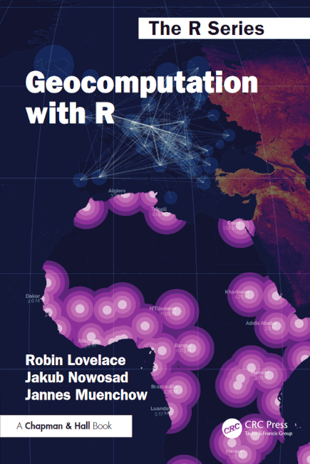

--- 
title: 'Geocomputation with R'
author: 'Robin Lovelace, Jakub Nowosad, Jannes Muenchow'
date: '2025-06-10'
site: bookdown::bookdown_site
output: bookdown::bs4_book
documentclass: krantz
monofont: "Source Code Pro"
monofontoptions: "Scale=0.7"
bibliography:
  - geocompr.bib
  - packages.bib
biblio-style: apalike
link-citations: yes
colorlinks: yes
graphics: yes
description: "Geocomputation with R は、オープンソースソフトウェアを使って地理データを分析、視覚化、モデル化するために書かれた。本書は、強力なデータ処理、可視化、地理空間機能を持つ統計プログラミング言語である R をベースにしている。本書は、科学的、社会的、環境的な意味合いを含む、地理データに現れるさまざまな問題に取り組むための知識とスキルを身につけることができる。地理情報システム (Geographic Information Systems, GIS) のユーザーで、データサイエンスのための強力なオープンソース言語での専門分野の知識の応用に興味がある人、R のユーザーで空間データを扱うスキルの拡張に興味がある人など、さまざまな立場の人が本書に興味を持つだろう。"
github-repo: "geocompx/geocompr-ja"
cover-image: "images/cover2.png"
url: https://r.geocompx.org/jp/
---


# ようこそ {- #index}

ここは、地理データの解析、可視化、モデリングに関する書籍 *Geocomputation with R* のオンラインホーム (日本語版) です。

<a href="https://www.routledge.com/9781138304512"></a>
  

本書 (原著) は、[CRC Press](https://www.routledge.com/9781032248882)または [Amazon](https://www.amazon.com/Geocomputation-Chapman-Hall-Robin-Lovelace-dp-1032248882/dp/1032248882) から購入することができます。

<!-- **注**: 本書の原著初版は CRC プレス社の [R Series](https://www.routledge.com/Chapman--HallCRC-The-R-Series/book-series/CRCTHERSER) で出版されています。
[CRC Press](https://www.routledge.com/9781138304512) または [Amazon](https://www.amazon.com/Geocomputation-R-Robin-Lovelace-dp-0367670577/dp/0367670577/) で購入できます。また、**初版** は、[bookdown.org](https://bookdown.org/robinlovelace/geocompr/) で保存されています。 -->

初版のアーカイブは、[bookdown.org](https://bookdown.org/robinlovelace/geocompr/) にてホストされています。

本書は、Free and Open Source Software for Geospatial ([FOSS4G](https://foss4g.org/)) の活動に触発されているおり、本書の基盤となるコードと解説はオープンであり、内容の再現性、透明性、アクセス性を保証しています。
[GitHub](https://github.com/geocompx/geocompr) でソースコードを公開しているため、誰でも課題 (Issue) を開いたり、新しいコンテンツや誤植の修正に貢献することでプロジェクトに関わり、みんなのために役立てることができます。

[](https://github.com/geocompx/geocompr)
[](https://github.com/geocompx/geocompr/graphs/contributors)

本書のオンライン版は、[r.geocompx.org](https://r.geocompx.org) でホストされ、[GitHub Actions](https://github.com/geocompx/geocompr/actions) によって最新版が維持されています。(訳注: 日本語版は、[https://r.geocompx.org/jp/](https://r.geocompx.org/jp/) でホストされている。)
現在の「ビルド状況」は以下の通りです。

[](https://github.com/geocompx/geocompr-jp/actions)

本書 (日本語版) は、2025-06-10 にビルドされました。

<a rel="license" href="http://creativecommons.org/licenses/by-nc-nd/4.0/"></a><br />本書は、<a rel="license" href="http://creativecommons.org/licenses/by-nc-nd/4.0/">Creative Commons Attribution-NonCommercial-NoDerivatives 4.0 International License</a> ライセンスで提供。

<a rel="license" href="https://creativecommons.org/publicdomain/zero/1.0/"></a><br/>本書のサンプルコードは、<a rel="license" href="https://creativecommons.org/publicdomain/zero/1.0/">Creative Commons CC0 1.0 Universal (CC0 1.0)</a> ライセンスで提供されています。

## 貢献するには {- #how-to-contribute}

**bookdown** では、GitHub のアカウント ([sign-up at github.com](https://github.com/join)) があれば、Wiki を編集するように簡単に本を編集することができます。
GitHub にログイン後、書籍サイトの右パネルにある「Edit this page」アイコンをクリックしてください。
これで、今読んでいるこのページを生成したソース [R Markdown](http://rmarkdown.rstudio.com/) ファイルの編集可能なバージョンに移動します。

この本の内容に関する問題提起 (コードが実行されないなど) や機能リクエストは、[Issue Tracker](https://github.com/geocompx/geocompr/issues) 課題追跡システムで確認できます。 

管理者と貢献者は、このリポジトリの[行動規範](https://github.com/geocompx/geocompr/blob/main/CODE_OF_CONDUCT.md) に従ってください。

## 本書のコードを再現  {- #reproducibility}

初めて R で地理データを扱うのであれば、手軽に本書の内容を再現する方法は、ウェブブラウザで [Binder](https://mybinder.org/) というサイトにアクセスすることでしょう。
以下のリンクをクリックすると、RStudio Server を含む新しいウィンドウがウェブブラウザで開き、各章のファイルを開いたり、コードチャンクを実行して、コードが再現可能かどうかテストすることができます (訳注: 英語版が開く)。

[](https://mybinder.org/v2/gh/geocompx/geocompr/main?urlpath=rstudio)

下の画像のようなものが表示されたら成功です。
[mybinder.org ユーザガイドライン](https://mybinder.readthedocs.io/en/latest/about/user-guidelines.html)に従い、クラウドベースの環境で R によるジオコンピュテーションの探求を始めてください。

<div class="figure">

<p class="caption">(\#fig:index-2-4)Geocomputation with R に含まれる再現可能なコードを、Binder が提供するブラウザ上の RStudio Server で実行した画面</p>
</div>

この本のコードを自分のコンピュータで再現するには、最近のバージョンの [R](https://cran.r-project.org/) と最新のパッケージが必要です。
パッケージは [**remotes**](https://github.com/r-lib/remotes) パッケージを使用してインストールすることができます。


``` r
install.packages("remotes")
remotes::install_github("geocompr/geocompkg")
```

この本で使用するパッケージやデータをインストールした後、テストや教育目的のためにこの本を再構築することができます。
再構築するには、この本のソースコードを [ダウンロード](https://github.com/geocompx/geocompr/archive/refs/heads/main.zip)して解凍するか、 [clone](https://docs.github.com/en/repositories/creating-and-managing-repositories/cloning-a-repository) してください。
[RStudio](https://posit.co/download/rstudio-desktop/#download) (または [VS Code](https://github.com/REditorSupport/vscode-R) などの他の IDE) で `geocompr.Rproj` プロジェクトを開き、以下のコマンドで内容を再現することができるようになります。


``` r
bookdown::serve_book(".")
```


再現の詳細は、同プロジェクトの [GitHub repo](https://github.com/geocompx/geocompr#reproducing-the-book) を参照。

## プロジェクトに参加 {- #getting-involved}

もし、この本が役に立つと思ったら、以下の方法で応援してください。

- この本について、人々に話す
- [geocompr GitHub repository](https://github.com/geocompx/geocompr) に[スターをつける](https://help.github.com/articles/about-stars/)
- [引用](https://github.com/geocompx/geocompr/raw/main/CITATION.bib)または[リンク](https://r.geocompx.org)を貼る
- オンラインで本書について伝える。例えば、Twitterの [#geocompr ハッシュタグ](https://twitter.com/hashtag/geocompr) を使う ([geocompr.github.ioのゲストブック](https://geocompr.github.io/guestbook/)を参照)、本書を使った[コース](https://github.com/geocompr/geocompr.github.io/edit/source/content/guestbook/index.md)について知らせる、等
- 一冊[購入](https://www.amazon.com/Geocomputation-R-Robin-Lovelace-dp-0367670577/dp/0367670577)する
- Amazon や [Goodreads](https://www.goodreads.com/book/show/42780859-geocomputation-with-r) でレビューを書く
- [GitHub](https://github.com/geocompx/geocompr/issues) または X (旧 Twitter) あるいは [Discord](https://discord.com/invite/PMztXYgNxp) で、質問や提案を行う (日本語の場合、[r-wakalang Slack](https://github.com/tokyor/r-wakalang) や [OSGeo 財団メーリングリスト](https://www.osgeo.jp/mailing_list) などがある)
- 質問に答えたり、質問がわかりにくい場合に説明や再現例を求めるなど何らかの応答をする
- 再現可能な研究に向けたオープンソースを皆に広める。とくに、R における地理データを扱う (これは、自分のスキルアップに最適な方法でもある)
- コミュニティによる翻訳
  - スペイン語版: https://geocompr.github.io/es/
  - フランス語版: https://geocompr.github.io/fr/
  - 日本語版: http://babayoshihiko.ddns.net/geo/

詳しくは、[github.com/geocompx/geocompr](https://github.com/geocompx/geocompr/issues) 参照。

<hr>

本書で使用している地球儀のアイコンは、[Jean-Marc Viglino](https://github.com/Viglino) によって作成され、[CC-BY 4.0 International](https://github.com/Viglino/font-gis/blob/main/LICENSE-CC-BY.md) のライセンスで提供されています。

<a href="https://www.netlify.com"></a>
本書のウェブサイト (英語版) は、[Netlify](https://www.netlify.com/) でホストされています。


# 序文 (第 1 版)  {- #foreword-1st-edition}

R で「空間的なこと」をすることは、常に幅が広い。興味がある人なら誰でも参加できるよう、地理学、ジオインフォマティクス、ジオコンピュテーション、空間統計学のツールを提供し統合することに努めてきた。
すなわち、R で「空間的なこと」をするということは、常にオープンソースコード、オープンデータ、そして再現性を含んでいるのである。

また、R で「空間的なこと」を行うことは、応用空間データ解析の多くの部門との相互作用に対してオープンであることを目指し、さらに、データ表現と解析方法の新しい進歩を実装し、それらを分野横断的な精査にさらすことを目的としている。 
本書が示すように、同じようなデータから同じような結果が得られる別のワークフローが存在することも多く、他の人がどのようにワークフローを作り、理解しているかを比較することで学ぶこともある。
これには、オープンソース GIS や Python、Java などの補完言語に関する類似のコミュニティから学ぶことも含まれる。

R の幅広い空間機能は、自分で作っているものや応用しているものを共有しようとする人たちがいなければ、決して進化しなかっただろう。
これには、教材、ソフトウェア、研究手法 (再現可能な研究、オープンデータ)、およびこれらの組み合わせが含まれる。 
また、GDAL、GEOS、PROJ といった「アップストリーム」のオープンソース地理ライブラリからも、R ユーザーは大きな恩恵を受けている。

本書は、好奇心と参加意欲があれば、自分の適性に合ったやるべきことが見つかるというわかりやすい例である。
データ表現とワークフローが進歩し、定量的なコマンドラインを使用しない新しいユーザーが増え続ける中、この種の本が本当に必要とされている。
多大な苦労があったにもかかわらず、著者たちは互いに支え合って出版に漕ぎ着けたのである。

この本は、著者がチュートリアルやワークショップで試行錯誤を重ね、読者や講師が自分のような人に試し続けてきた内容であることがわかるので、すぐにでも使える。
著者や R-spatial コミュニティと関わり、ワークフローを構築する上でより多くの選択肢を持つことに価値を見出し、そして最も重要なことは、ここで学んだことを自分の関心のあることに適用することを楽しむことである。

Roger Bivand

ベルゲン、2018年9月

# 序文 (第 2 版) {- #forward-2nd-edition}

オープンソースのデータサイエンスソフトウェアは制御不能な方法で常に変化し続けており、このテーマで書籍を書くことは、勇気ある挑戦です。それは、誰かが常にゴールラインを移動させ続ける中でレースを走るようなものです。この『Geocomputation with R』の第 2 版は、まさに適切なタイミングで出版されました。本書は、最近の多くの変更に対応するだけでなく、新しい R パッケージや計算環境における新たな動向も取り入れています。 本書には、ラスタとベクタの相互作用に関する章が追加され、ラスタ (およびベクタ) データ処理でパッケージ **raster** に代わる **terra** パッケージについて解説しています。また、高品質な地図作成のための **tmap** パッケージについても、バージョンアップが完了した最新状況に対応しています。

著者は、本書の内容を更新するだけでなく、ソフトウェアの変更を効率化し、焦点を絞るため、広範なテストを実施し、改善を支援し、GitHub で Issue や Pull Request を投稿し、ベンチマーク結果を共有し、ソフトウェアのドキュメント改善にも貢献してきました。

本書の初版は大きな成功を収めました。これは、**sf** パッケージと**tidyverse** を使用して空間分析を普及させた最初の書籍でした。その熱意は幅広い読者に届き、多様な経験レベルの人が新たな問題解決に取り組み、次の段階へ進むのを支援しました。 印刷版に加え、オンラインで完全に無料で利用可能だったため、広い範囲の人々に届き、提示された手法を自身のデータセットで試すことができました。さらに、著者は GitHub の Issue、ソーシャルメディアの投稿、Discord チャネルでの議論を通じて連絡を取るよう促してきました。これにより、75 人が何らかの形で書籍のソースコードに貢献し、そのうち数人は詳細なレビューを提供したり、Cloud-optimized GeoTIFFs、STAC、openEO に関するセクションを執筆したり、**sfheaders** パッケージ、OGC APIとメタデータ、`CycleHire` Shiny アプリなどに関するセクションを執筆しました。Discord では、高度な技術的な話題から「私が作ったものを見てください」といった内容まで、多様なトピックを含むスレッドで活発で即興的な議論が展開されました。

さらに、著者は『Geocomputation with Python』という関連書籍の執筆を開始しています。ジオコンピューテーションはデータサイエンス言語を用いて行われるものであり、決して特定の言語に限定されるものではないと強調しています。ジオコンピューテーションは急速に発展しており、成長するジオコンピューテーションコミュニティの育成の一環として、このような書籍の執筆は不可欠です。

Edzer Pebesma

Münster, Germany, May 2024

# 序文  {- #preface}

## 本書の対象  {- #who-this-book-is-for}

本書は、オープンソースソフトウェアを使って地理データを分析、視覚化、モデル化したい人のための本である。
強力なデータ処理、可視化、地理空間機能を持つ統計プログラミング言語である R をベースにしている。
本書は幅広いトピックをカバーしており、特に様々な背景を持つ幅広い人々に興味を持っていただけると思われる。

- [QGIS](https://qgis.org/en/site/)、[ArcGIS](http://desktop.arcgis.com/en/arcmap/)、 [GRASS](https://grass.osgeo.org/)、[SAGA](https://saga-gis.sourceforge.io/en/index.html) などのデスクトップ地理情報システム (GIS) を使って空間分析力を身につけた人が、強力な (ジオ) 統計・視覚化プログラミング言語とコマンドラインアプローチの利点にアクセスしたい [@sherman_desktop_2008]。

  > With the advent of 'modern' GIS software, most people want to point and click their way through life. That’s good, but there is a tremendous amount of flexibility and power waiting for you with the command line.

- 地理学、リモートセンシング、計画、GIS、空間データ科学など、地理データを専門とする分野の大学院生・研究者
- 地質学、地域科学、生物学と生態学、農業科学、考古学、疫学、輸送モデリング、および広義のデータ科学などの分野で地理データを扱っている研究者や大学院生で、研究に R のパワーと柔軟性を必要としている人。
- 都市・交通計画、物流、ジオマーケティング (店舗立地分析)、緊急時計画など、多様な空間データを扱うアプリケーションにおいて、Rなどのコマンドライン言語の再現性、スピード、柔軟性を必要とする公共、民間、第三セクターの応用研究者やアナリストの方

本書は、ジオコンピュテーションに興味のある中級から上級の R ユーザーと、地理データを扱ったことのある R 初心者を対象にしている。
R も地理データも初めてという方は、Chapter \@ref(spatial-class) と下に用意したリンクで、初心者の視点から空間データの本質を解説している。

## 本書の読み方  {- #how-to-read-this-book}

本書は 3 つのパートに分かれている。

1. 第 I 部: 基本機能では、R で地理データを扱うための知識を身につけることを目的としている。
2. 第 II 部: 拡張機能では、高度なテクニックを網羅する。具体的には、空間データの可視化、GIS へのブリッジ、空間データのプログラミング、統計学習。
3. 第 III 部: 応用では、実際の問題への対応。具体例として、交通解析、商圏分析、生態学。

章ごとにだんだん難しくなっていく。
このため、第 I 部はすべて読んでいただき、第 II 部、第 III 部に取り組んでいただきたい。
第 II 部、第 III 部は、順に読んでいただくとよいが、興味のある章だけを読むこともできる。
R で地理解析を行う際の大きな障壁は、その学習曲線が急であることである。
第I部の各章では、簡単なデータセットで再現可能なコードを提供することで、この問題に対処することを目的としている。

教える・学ぶという観点でこの本の重要な点は、各章の最後にある**演習**である。
演習を修了することで、地理空間に関するさまざまな問題に取り組むために必要なスキルを身につけ、自信を持つことができる。
演習の解答は、 [geocompr.github.io/solutions](https://geocompr.github.io/solutions/) でホストされている Geocomputation with R に付属するオンラインブックレットで見ることができる。
この冊子の作成方法、および [_01-ex.Rmd](https://github.com/geocompx/geocompr/blob/main/_01-ex.Rmd) などのファイルの解答を更新する方法については、この [blog post](https://geocompr.github.io/post/2022/geocompr-solutions/) を参照。
その他のブログ記事と拡張例は、この本のサポートサイト（[geocompx.org](https://geocompx.org)）を参照。

急ぎたい場合は、Chapter \@ref(spatial-class)  から始まる実用的な例題にすぐに取り組むこともできる。
しかし、まずは Chapter \@ref(intro)  の *Geocomputation with R* の広い文脈を読むことを勧める。
また、R に初めて触れる方は、各章で提供されるコードチャンクを実行しようとする前に、この言語についてもっと学ぶことを勧める（概念を理解するためにこの本を読む場合は別）。
R の初心者にとって幸いなことに、R にはサポートするコミュニティがあり、助けとなるリソースが豊富に開発されている。
特にお勧めのチュートリアルは、[R for Data Science](https://r4ds.had.co.nz/) [@grolemund_r_2016] と [Efficient R Programming](https://csgillespie.github.io/efficientR/) [@gillespie_efficient_2016]、そして [An introduction to R](http://colinfay.me/intro-to-r/) [@rcoreteam_introduction_2021] の 3 つである。

## なぜ R なのか？  {- #why-r}

R の学習曲線は急であるが、本書で提唱するコマンドラインアプローチはすぐに成果を上げることができる。
この後の章で学ぶように、R は地理データに関するさまざまな課題に取り組むための効果的なツールである。
練習を重ねれば、R が地理空間ツールボックスの中で、多くのアプリケーションに選ばれるプログラムになることを期待している。
コマンドラインでコマンドを入力して実行する方が、デスクトップ GIS のグラフィカル・ユーザー・インターフェース (GUI) をマウスで操作するよりも速い場合が多くある。
空間統計やモデリングなどのアプリケーションでは、R が唯一の現実的な方法だろう。

Section \@ref(why-use-r-for-geocomputation)  で概説したように、ジオコンピュテーションに R を使用する理由はたくさんある。
R は、他の言語と比較して、多くの地理データ解析ワークフローで必要とされる対話的な使用に適している。
R は、データサイエンス（データ加工、統計学習技術、データの可視化など）やビッグデータ（データベースや分散コンピューティングシステムとの効率的なインターフェースによる）の分野で急速に発展している分野に優れている。
さらに、R は再現性のあるワークフローを可能にする。分析の基礎となるスクリプトを共有することで、他の人があなたの研究を発展させることができるのである。
本書での再現性を確保するために、ソースコードを [github.com/geocompx/geocompr](https://github.com/geocompx/geocompr#geocomputation-with-r) で公開している。
上記サイトでは、`code/` フォルダに数値を生成するスクリプトファイルがある。
図を生成するコードが書籍の本文に記載されていない場合、図を生成したスクリプトファイル名をキャプションに記載する（例えば、 Figure \@ref(fig:zones)  のキャプションを参照）。

Python、Java、C++ などの他の言語もジオコンピュテーションに使用でき、Section \@ref(software-for-geocomputation) で説明したように、<u>R を使わずに</u>ジオコンピュテーションを学ぶための優れたリソースがある。
R コミュニティが提供するパッケージ・エコシステム、統計機能、可視化オプション、強力な IDE のユニークな組み合わせは、いずれも提供されていない。
さらに、1つの言語（R）の使い方を深く学ぶことで、他の言語でジオコンピュテーションを行うために必要な概念と自信を身につけることができる。

## 実世界への影響  {- #real-world-impact}

*Geocomputation with R* は、地理データに現れる科学的、社会的、環境的な意味を含む幅広い問題に取り組むための知識とスキルを身につけることができる。
Section \@ref(what-is-geocomputation)  にあるように、ジオコンピュテーションは、コンピュータを使って地理データを処理することだけが目的ではない。
また、現実的なインパクトも重要である。
本書の背景や動機に興味がある方は、Chapter \@ref(intro) を参照。

## 謝辞  {- #acknowledgements}


プルリクエストで直接貢献してくださった以下の方々をはじめ、コードのホスティングとコラボレーションサイトである GitHub を通じて直接、間接的に貢献してくださった以下の皆様に感謝する: prosoitos, florisvdh, babayoshihiko, katygregg, tibbles-and-tribbles, Lvulis, rsbivand, iod-ine, KiranmayiV, cuixueqin, defuneste, zmbc, erstearns, FlorentBedecarratsNM, dcooley, darrellcarvalho, marcosci, appelmar, MikeJohnPage, eyesofbambi, krystof236, nickbearman, tylerlittlefield, giocomai, KHwong12, LaurieLBaker, MarHer90, mdsumner, pat-s, sdesabbata, ahmohil, ateucher, annakrystalli, andtheWings, kant, gavinsimpson, Himanshuteli, yutannihilation, howardbaek, jimr1603, jbixon13, olyerickson, yvkschaefer, katiejolly, kwhkim, layik, mpaulacaldas, mtennekes, mvl22, ganes1410, richfitz, VLucet, wdearden, yihui, adambhouston, chihinl, cshancock, e-clin, ec-nebi, gregor-d, jasongrahn, p-kono, pokyah, schuetzingit, tim-salabim, tszberkowitz, and vlarmet。
表紙画像を作成しただけでなく、それを生成するコードも公開してくれた Marco Sciaini 氏に感謝する (本書の GitHub リポジトリの `code/frontcover.R` を参照)。 
さらに何十人もの人々が、問題提起やコメント、ソーシャルメディアを通じてのフィードバックなど、オンラインで貢献した。
 `#geocompr` ハッシュタグは生き続けます!

CRC プレス社の John Kimmel 氏には、2 年以上にわたって私たちのアイデアを初期の書籍企画から 4 回の査読を経て製品化するまでに協力していただいたことに感謝する。
本書の構成と内容を大幅に改善するために、詳細なフィードバックと専門知識を提供してくださった査読者の方々は、特筆に値する。

また、この章では、Jena 大学の Patrick Schratz 氏と Alexander Brenning 氏との有意義な議論とご意見に感謝する。
ウェブサービスに関するセクションで専門的なご意見をいただいた国際連合食糧農業機関の Emmanuel Blondel 氏に感謝する。
Michael Sumnerv 氏には、本書の多くの部分、特に第 10 章のアルゴリズムに関する議論に重要な示唆をいただいた。
Tim Appelhans 氏と David Cooley 氏は、可視化の章 (第 8 章) で重要な貢献をした。
さらに、Katy Greggv 氏は、すべての章を校正し、本書の読みやすさを大きく向上させた。

他にも数え切れないほど、さまざまな形で貢献された方がいるだろう。
最後に、R によるジオコンピュテーションを可能にしているすべてのソフトウェア開発者に感謝する。
Edzer Pebesma (**sf**パッケージを作成)、Robert Hijmans (**raster** を作成)、Roger Bivand (多くの R-spatial ソフトウェアの基礎を作った) は、R で高性能な地理計算を可能にした。
